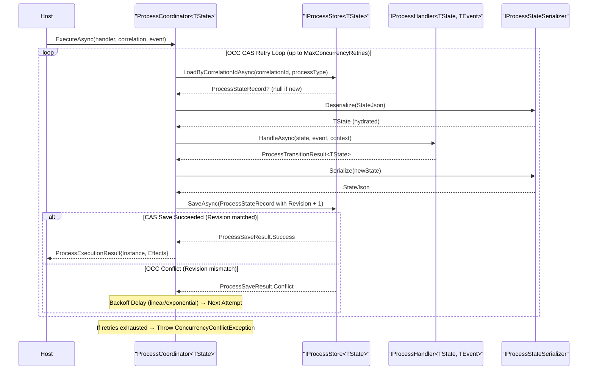
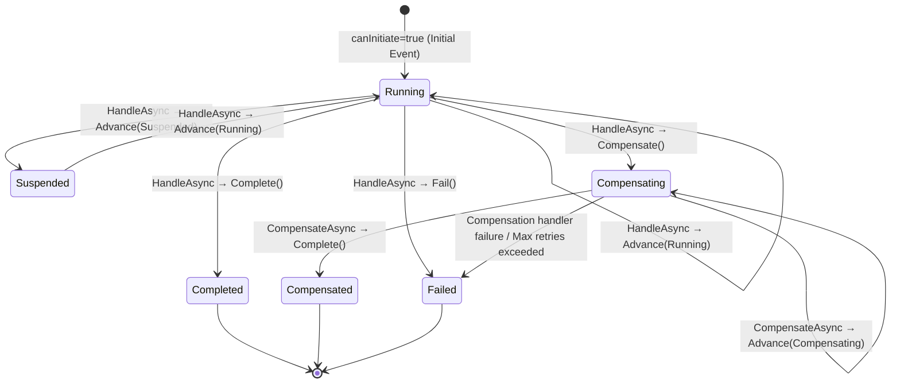

# EricksonLopez.Processes

High-performance, trimming-safe, and Native AOT-ready Process Manager and Saga orchestration ecosystem for modern .NET.

[](https://github.com/ericksonlopezf/dotnet-processes/actions)
[](https://codecov.io/gh/ericksonlopezf/dotnet-processes)
[](https://sonarcloud.io/summary/new_code?id=ericksonlopezf_dotnet-processes)
[](https://github.com/ericksonlopezf/dotnet-processes/blob/main/docs/ci-cd.md)
[](https://www.nuget.org/packages/EricksonLopez.Processes)
[](https://www.nuget.org/packages/EricksonLopez.Processes)
[](https://github.com/ericksonlopezf/dotnet-processes/blob/main/LICENSE)
[](https://dotnet.microsoft.com)
[](https://learn.microsoft.com/en-us/dotnet/core/deploying/native-aot)

`EricksonLopez.Processes` is an enterprise-grade, zero-reflection Process Manager and distributed Saga orchestration ecosystem engineered specifically for high-throughput, event-driven architectures in .NET 10+. It eliminates heavy in-memory workflow runtimes, distributed locking contention, and reflection overhead by combining deterministic Optimistic Concurrency Control (OCC / CAS with monotonic `Revision` tokens), zero-allocation value types, compile-time Roslyn source generation, multi-database persistence adapters, and native OpenTelemetry observability into an AOT-first foundation.

---

## Table of Contents

- [What Problem It Solves](#-what-problem-it-solves)
- [Key Features](#-key-features)
- [Ecosystem](#-ecosystem)
- [Documentation](#-documentation)
  - [Step-by-Step Interactive Showcase (Levels 00 to 10)](#-step-by-step-interactive-showcase-levels-00-to-10)
  - [Technical Reference & Architecture Guides](#-technical-reference--architecture-guides)
- [Installation](#-installation)
- [Quick Start](#-quick-start)
  - [1. Define State, Events, and Commands](#1-define-state-events-and-commands)
  - [2. Implement the Saga with Compensation](#2-implement-the-saga-with-compensation)
  - [3. Execute via ProcessCoordinator with Correlation](#3-execute-via-processcoordinator-with-correlation)
  - [4. Zero-Boilerplate DI Registration via Source Generator](#4-zero-boilerplate-di-registration-via-source-generator)
  - [5. Schema Evolution & Version Migration Pipeline](#5-schema-evolution--version-migration-pipeline)
- [Core Use Cases](#-core-use-cases)
  - [Use Case 1: Clean Architecture / Event-Driven Order Fulfillment Saga](#use-case-1-clean-architecture--event-driven-order-fulfillment-saga)
  - [Use Case 2: Multi-Step Onboarding with OCC CAS Coordination](#use-case-2-multi-step-onboarding-with-occ-cas-coordination)
  - [Use Case 3: Outbox-Backed Reliable Side-Effect Publication](#use-case-3-outbox-backed-reliable-side-effect-publication)
  - [Use Case 4: Reverse-Order Compensation for Distributed Rollbacks (LIFO)](#use-case-4-reverse-order-compensation-for-distributed-rollbacks-lifo)
  - [Use Case 5: Zero-Downtime State Schema Evolution](#use-case-5-zero-downtime-state-schema-evolution)
  - [Use Case 6: Deterministic In-Memory Testing & Chaos Simulation](#use-case-6-deterministic-in-memory-testing--chaos-simulation)
- [Configuration & Integrations](#-configuration--integrations)
  - [Microsoft Dependency Injection](#microsoft-dependency-injection)
  - [Database Storage Providers](#database-storage-providers)
  - [Effect Dispatchers (Events, Mediator, Outbox)](#effect-dispatchers-events-mediator-outbox)
  - [OpenTelemetry Tracing & Metrics](#opentelemetry-tracing--metrics)
  - [Native AOT System.Text.Json Serialization](#native-aot-systemtextjson-serialization)
  - [Roslyn Diagnostic Analyzers](#roslyn-diagnostic-analyzers)
  - [Advanced API Reference](#advanced-api-reference)
- [Testing & Quality](#-testing--quality)
  - [In-Memory State Store Testing](#in-memory-state-store-testing)
  - [OCC Concurrency Conflict Simulation](#occ-concurrency-conflict-simulation)
  - [Stryker.NET Mutation Testing Quality Gates](#strykernet-mutation-testing-quality-gates)
- [Performance Benchmarks](#-performance-benchmarks)
  - [Execution Latency & Allocation Summary](#execution-latency--allocation-summary)
  - [Allocation Analysis & Architectural Guarantees](#allocation-analysis--architectural-guarantees)
- [Compatibility & Technical Matrix](#-compatibility--technical-matrix)
  - [Target Frameworks & Native AOT Support](#target-frameworks--native-aot-support)
  - [Ecosystem Responsibility Matrix](#ecosystem-responsibility-matrix)
  - [Storage Capabilities Matrix](#storage-capabilities-matrix)
- [Architecture & Design Principles](#-architecture--design-principles)
  - [Clean Architecture & Layered Package Boundaries](#clean-architecture--layered-package-boundaries)
  - [Coordinator OCC Execution Loop](#coordinator-occ-execution-loop)
  - [Process Lifecycle Finite State Machine](#process-lifecycle-finite-state-machine)
- [Best Practices & Anti-Patterns](#-best-practices--anti-patterns)
- [Troubleshooting & Common Pitfalls](#-troubleshooting--common-pitfalls)
- [Part of the EricksonLopez Ecosystem](#-part-of-the-ericksonlopez-ecosystem)
- [Contributing](#-contributing)
- [License](#-license)

---

## 🎯 What Problem It Solves

### The Traditional Workflow Dilemma

Building stateful workflows, distributed sagas, and multi-step business coordination in microservices and distributed systems traditionally suffers from critical architectural pitfalls:

1. **The Heavyweight Runtime Tax**: Traditional workflow orchestrators (e.g., BPMN engines, persistent orchestrator actors) hold workflow execution state in memory, pinning OS threads and consuming massive heap allocations for long-lived processes.
2. **Concurrency Hazards & Distributed Locking**: High-throughput distributed event streams cause race conditions when concurrent events arrive for the same workflow instance. Teams often resort to heavy distributed locks (Redis Redlock, Consul, database row locks), degrading throughput and introducing deadlock vulnerabilities.
3. **Magical Rollbacks vs Distributed Realities**: In distributed microservice architectures, true atomic ACID 2-phase commits across autonomous databases are an anti-pattern. Workflows require explicit, deterministic compensating transactions executed in strict reverse dependency order (LIFO).
4. **Reflection Overhead & Native AOT Incompatibility**: Most existing saga libraries rely heavily on runtime reflection (`Activator.CreateInstance`, `Assembly.GetTypes()`, dynamic proxy interceptors), which prevents compilation with Native AOT and triggers fatal trimming warnings.
5. **Infrastructure Coupling & Leakage**: Domain workflows frequently become tightly coupled to specific message brokers (RabbitMQ, Kafka, Azure Service Bus) or persistence frameworks (EF Core, ORMs), making pure unit testing impossible.

### How `EricksonLopez.Processes` Solves This

- **Persist State, Never the Runtime**: Workflows do not stay resident in memory. Upon an incoming event trigger, the instance state hydrates from durable storage, applies pure deterministic transitions, persists state via atomic CAS tokens (`Revision`), emits outbound intent effects (commands/events), and suspends or completes.
- **Lock-Free Optimistic Concurrency Control (OCC CAS)**: State transitions use atomic monotonic `Revision` tokens with automatic linear/exponential backoff retry loops, achieving sub-microsecond state transitions in the in-memory coordination path (without network I/O) under high concurrency without database locks.
- **First-Class Reverse-Order Compensation (LIFO)**: Compensating actions are recorded alongside forward steps with immutable payloads and dispatched sequentially in reverse order (`Compensating` -> `Compensated` or `Failed`).
- **100% Native AOT & Trimming Compliance**: Zero runtime reflection. Roslyn Incremental Source Generators register process definitions and build DI tables at compile time, accompanied by Roslyn Analyzers enforcing transition correctness.
- **Pure Domain Isolation (Clean Architecture)**: The core domain and abstractions have **zero external dependencies**. Workflows produce pure side-effect intents (`ProcessEffect.Command`, `ProcessEffect.Event`, `ProcessEffect.Timeout`), leaving network transport and broker dispatching to dedicated perimeter adapters.

---

## ⚡ Key Features

- 🏎️ **Ultra-Low Latency & Zero-Allocation Identifiers**: Struct-based value types (`ProcessId`, `Revision`, `CorrelationId`, `ProcessVersion`, `CausationId`) implementing `ISpanParsable<T>` and `ISpanFormattable` format directly into stack buffers with **0 B heap allocations**.
- 🔒 **Deterministic Optimistic Concurrency Control**: Monotonic revision tokens prevent lost updates across concurrent workers without distributed locking.
- 🔄 **Explicit Reverse-Order Compensation Engine**: Full support for distributed sagas with automated LIFO compensation rollbacks and failure escalation.
- ⚙️ **Compile-Time Roslyn Source Generator**: Auto-discovers `[ProcessDefinition]` and `[SagaDefinition]` classes to generate AOT-safe dependency injection extensions (`AddGeneratedProcesses()`).
- 🛡️ **Roslyn Diagnostic Analyzers**: Real-time compile-time inspection verifying state machine completeness (`PROC001`) and compensation coverage (`PROC002`).
- 📊 **Deep OpenTelemetry Observability**: Built-in `ActivitySource` tracing and `System.Diagnostics.Metrics` reporting total executions, OCC retry counts, effect emissions, and execution latency.
- 🗄️ **Multi-Database Persistent Adapters**: Production-ready storage adapters for PostgreSQL (JSONB), SQL Server, SQLite, MySQL, MariaDB, and Oracle.
- 🔌 **Seamless Ecosystem Integrations**: Native bridge packages for `EricksonLopez.Events`, `EricksonLopez.Mediator`, and `EricksonLopez.Outbox`.
- 🧬 **Zero-Downtime Schema Evolution**: Fluent `ProcessStateMigrationPipeline` for deterministic version upgrades across evolving state schemas.

---

## 📦 Ecosystem

| Package | Version | Description |
|---|---|---|
| [`EricksonLopez.Processes.Abstractions`](https://www.nuget.org/packages/EricksonLopez.Processes.Abstractions) | [](https://www.nuget.org/packages/EricksonLopez.Processes.Abstractions) | Pure abstractions, strongly typed identifiers, state contracts, and store interfaces. Zero external dependencies. |
| [`EricksonLopez.Processes`](https://www.nuget.org/packages/EricksonLopez.Processes) | [](https://www.nuget.org/packages/EricksonLopez.Processes) | Core Process Manager and Saga execution engine, compensation runner, and correlation primitives. |
| [`EricksonLopez.Processes.Generator`](https://www.nuget.org/packages/EricksonLopez.Processes.Generator) | [](https://www.nuget.org/packages/EricksonLopez.Processes.Generator) | Roslyn incremental source generator for compile-time registration and `AddGeneratedProcesses()` DI extension. |
| [`EricksonLopez.Processes.Analyzers`](https://www.nuget.org/packages/EricksonLopez.Processes.Analyzers) | [](https://www.nuget.org/packages/EricksonLopez.Processes.Analyzers) | Roslyn analyzers validating state machine completeness, unhandled transition compensation, and process invariants. |
| [`EricksonLopez.Processes.DependencyInjection`](https://www.nuget.org/packages/EricksonLopez.Processes.DependencyInjection) | [](https://www.nuget.org/packages/EricksonLopez.Processes.DependencyInjection) | `IServiceCollection` extension methods for registering coordinators and stores. |
| [`EricksonLopez.Processes.SystemTextJson`](https://www.nuget.org/packages/EricksonLopez.Processes.SystemTextJson) | [](https://www.nuget.org/packages/EricksonLopez.Processes.SystemTextJson) | System.Text.Json AOT-compatible serialization helpers and converters for process identifiers. |
| [`EricksonLopez.Processes.Events`](https://www.nuget.org/packages/EricksonLopez.Processes.Events) | [](https://www.nuget.org/packages/EricksonLopez.Processes.Events) | Event dispatching integration bridging process manager effects to `EricksonLopez.Events.Contracts`. |
| [`EricksonLopez.Processes.Mediator`](https://www.nuget.org/packages/EricksonLopez.Processes.Mediator) | [](https://www.nuget.org/packages/EricksonLopez.Processes.Mediator) | In-process mediator dispatching integration bridging effects to `EricksonLopez.Mediator`. |
| [`EricksonLopez.Processes.Outbox`](https://www.nuget.org/packages/EricksonLopez.Processes.Outbox) | [](https://www.nuget.org/packages/EricksonLopez.Processes.Outbox) | Outbox pattern integration dispatching effects reliably via `EricksonLopez.Outbox`. |
| [`EricksonLopez.Processes.Storage.PostgreSql`](https://www.nuget.org/packages/EricksonLopez.Processes.Storage.PostgreSql) | [](https://www.nuget.org/packages/EricksonLopez.Processes.Storage.PostgreSql) | High-performance PostgreSQL persistence provider using Npgsql and JSONB state storage. |
| [`EricksonLopez.Processes.Storage.SqlServer`](https://www.nuget.org/packages/EricksonLopez.Processes.Storage.SqlServer) | [](https://www.nuget.org/packages/EricksonLopez.Processes.Storage.SqlServer) | High-performance SQL Server persistence provider using Microsoft.Data.SqlClient and JSON state storage. |
| [`EricksonLopez.Processes.Storage.Sqlite`](https://www.nuget.org/packages/EricksonLopez.Processes.Storage.Sqlite) | [](https://www.nuget.org/packages/EricksonLopez.Processes.Storage.Sqlite) | High-performance SQLite persistence provider using Microsoft.Data.Sqlite and JSON state storage. |
| [`EricksonLopez.Processes.Storage.MySql`](https://www.nuget.org/packages/EricksonLopez.Processes.Storage.MySql) | [](https://www.nuget.org/packages/EricksonLopez.Processes.Storage.MySql) | High-performance MySQL persistence provider using MySqlConnector and JSON state storage. |
| [`EricksonLopez.Processes.Storage.MariaDb`](https://www.nuget.org/packages/EricksonLopez.Processes.Storage.MariaDb) | [](https://www.nuget.org/packages/EricksonLopez.Processes.Storage.MariaDb) | High-performance MariaDB persistence provider using MySqlConnector and JSON state storage. |
| [`EricksonLopez.Processes.Storage.Oracle`](https://www.nuget.org/packages/EricksonLopez.Processes.Storage.Oracle) | [](https://www.nuget.org/packages/EricksonLopez.Processes.Storage.Oracle) | High-performance Oracle persistence provider using Oracle.ManagedDataAccess.Core and JSON state storage. |
| [`EricksonLopez.Processes.Testing`](https://www.nuget.org/packages/EricksonLopez.Processes.Testing) | [](https://www.nuget.org/packages/EricksonLopez.Processes.Testing) | Testing utilities, doubles, InMemory test store with atomic CAS, and chaos fault injectors. |

---

## 📚 Documentation

> 🌐 **Official Documentation Hub:** [https://github.com/ericksonlopezf/dotnet-processes/tree/main/docs](https://github.com/ericksonlopezf/dotnet-processes/tree/main/docs)

### 🎓 Step-by-Step Interactive Showcase (Levels 00 to 10)

> 💡 **Master Showcase Guide:** Explore the complete interactive curriculum and reference implementation in [Showcase Curriculum Hub](https://github.com/ericksonlopezf/dotnet-processes/blob/main/docs/showcase/index.md).

| Level | Topic | Description |
|---|---|---|
| [**Level 00**](https://github.com/ericksonlopezf/dotnet-processes/blob/main/docs/showcase/level-00-conceptual.md) | **Conceptual Foundations** | Core philosophy, execution model, state persistence vs runtime locks, and alternatives comparison. |
| [**Level 01**](https://github.com/ericksonlopezf/dotnet-processes/blob/main/docs/showcase/level-01-quickstart.md) | **Quick Start** | Minimal setup, dependency injection, and first executing process. |
| [**Level 02**](https://github.com/ericksonlopezf/dotnet-processes/blob/main/docs/showcase/level-02-full-configuration.md) | **Full Configuration** | Options, builders, extension methods, logging, serialization, and value objects. |
| [**Level 03**](https://github.com/ericksonlopezf/dotnet-processes/blob/main/docs/showcase/level-03-real-world-use-cases.md) | **Real-World Use Cases** | Distributed sagas, multi-step coordination, and LIFO compensation. |
| [**Level 04**](https://github.com/ericksonlopezf/dotnet-processes/blob/main/docs/showcase/level-04-advanced-integration.md) | **Advanced Integration** | Reliable side-effects with Outbox, Mediator, and Event Bus dispatchers. |
| [**Level 05**](https://github.com/ericksonlopezf/dotnet-processes/blob/main/docs/showcase/level-05-processing-and-concurrency.md) | **Processing & Concurrency** | Optimistic concurrency control (OCC CAS), linear/exponential backoff, and timeouts. |
| [**Level 06**](https://github.com/ericksonlopezf/dotnet-processes/blob/main/docs/showcase/level-06-error-handling-and-recovery.md) | **Error Handling & Recovery** | Transient vs permanent errors, dead-letter patterns, and compensation escalation. |
| [**Level 07**](https://github.com/ericksonlopezf/dotnet-processes/blob/main/docs/showcase/level-07-scalability-and-performance.md) | **Scalability & Performance** | Multi-instance scale-out, zero-allocation span parsing, and OpenTelemetry observability. |
| [**Level 08**](https://github.com/ericksonlopezf/dotnet-processes/blob/main/docs/showcase/level-08-customization.md) | **Customization** | Custom store implementations, custom serializers, and snapshot repositories. |
| [**Level 09**](https://github.com/ericksonlopezf/dotnet-processes/blob/main/docs/showcase/level-09-extensions-and-storage.md) | **Extensions & Storage** | Persistence adapters for 6 RDBMS engines (PostgreSQL, SQL Server, SQLite, MySQL, MariaDB, Oracle). |
| [**Level 10**](https://github.com/ericksonlopezf/dotnet-processes/blob/main/docs/showcase/level-10-enterprise-architecture.md) | **Enterprise Architecture** | Clean Architecture boundaries, zero-downtime schema evolution, and Roslyn source generation. |

### 📖 Technical Reference & Architecture Guides

- [**Public API Inventory**](https://github.com/ericksonlopezf/dotnet-processes/blob/main/docs/audit/public-api-inventory.md) — Exhaustive inventory of all public classes, records, interfaces, enums, structs, and extension methods.
- [**Architecture & Diagrams**](https://github.com/ericksonlopezf/dotnet-processes/blob/main/docs/architecture/architecture-and-diagrams.md) — Visual reference for package boundaries, OCC loops, FSM lifecycles, and telemetry flow.
- [**Architecture Overview**](https://github.com/ericksonlopezf/dotnet-processes/blob/main/docs/architecture/overview.md) — System overview, coordinator lifecycle, and state hydration patterns.
- [**State Machine Lifecycle**](https://github.com/ericksonlopezf/dotnet-processes/blob/main/docs/architecture/state-machine.md) — Formal transition semantics and terminal state guarantees.
- [**API Reference**](https://github.com/ericksonlopezf/dotnet-processes/blob/main/docs/guides/api-reference.md) — Exhaustive technical specification for all public types, records, and interfaces.
- [**Cookbook & Recipes**](https://github.com/ericksonlopezf/dotnet-processes/blob/main/docs/guides/cookbook.md) — Production-tested recipes for PostgreSQL, Outbox, composite keys, and Native AOT.
- [**Quick Start Guide**](https://github.com/ericksonlopezf/dotnet-processes/blob/main/docs/guides/quick-start.md) — Rapid 5-minute onboarding guide to defining and executing your first process.
- [**Building Sagas Guide**](https://github.com/ericksonlopezf/dotnet-processes/blob/main/docs/guides/building-sagas.md) — Comprehensive guide to distributed saga orchestration and compensation modeling.
- [**PostgreSQL + Dapper Store**](https://github.com/ericksonlopezf/dotnet-processes/blob/main/docs/guides/postgresql-dapper-store.md) — Setup and schema guidelines for PostgreSQL persistence.
- [**Outbox & EventBus Integration**](https://github.com/ericksonlopezf/dotnet-processes/blob/main/docs/guides/outbox-eventbus-integration.md) — Deep dive into dispatching side effects reliably via Outbox and EventBus.
- [**Performance Guide**](https://github.com/ericksonlopezf/dotnet-processes/blob/main/docs/guides/performance-guide.md) — Zero-allocation techniques, span formatting, and benchmark throughput analysis.
- [**Benchmark Results**](https://github.com/ericksonlopezf/dotnet-processes/blob/main/docs/benchmarks/results.md) — Official BenchmarkDotNet performance metrics, allocation analysis, and hardware specifications.
- [**State Migration Guide**](https://github.com/ericksonlopezf/dotnet-processes/blob/main/docs/guides/migration-guide.md) — Zero-downtime schema evolution using `ProcessStateMigrationPipeline`.
- [**Troubleshooting Guide**](https://github.com/ericksonlopezf/dotnet-processes/blob/main/docs/guides/troubleshooting.md) — Common errors, concurrency conflict resolution, and diagnostic steps.
- [**FAQ**](https://github.com/ericksonlopezf/dotnet-processes/blob/main/docs/guides/faq.md) — Frequently asked questions regarding architecture, concurrency, and serialization.
- [**Best Practices & Guidelines**](https://github.com/ericksonlopezf/dotnet-processes/blob/main/docs/guides/best-practices.md) — Immutable state design, pure transitions, and saga rollback rules.
- [**Feature Matrix & Decisions**](https://github.com/ericksonlopezf/dotnet-processes/blob/main/docs/feature-matrix.md) — Detailed 55-feature evaluation, capabilities, and design decisions.
- [**CI/CD & Quality Gates**](https://github.com/ericksonlopezf/dotnet-processes/blob/main/docs/ci-cd.md) — GitHub Actions pipelines, Stryker mutation gates, and Native AOT smoke testing.
- [**Architectural Decision Records (ADRs)**](https://github.com/ericksonlopezf/dotnet-processes/tree/main/docs/adr) — Index of 41 formal ADRs documenting all system design choices.
- [**Competitor Analysis**](https://github.com/ericksonlopezf/dotnet-processes/blob/main/docs/concepts/competitor-analysis.md) — In-depth architectural comparison vs MassTransit, Elsa, Temporal, and Dapr.
- [**Boundary Specification**](https://github.com/ericksonlopezf/dotnet-processes/blob/main/BOUNDARY.md) — Zero-dependency invariants for `EricksonLopez.Processes.Abstractions`.

---

## 📥 Installation

Install the packages via the .NET CLI or Package Manager Console based on your architectural requirements.

### 1. Core Engine & Abstractions (Required)

```bash
# Pure abstractions, IDs, and contracts (zero dependencies)
dotnet add package EricksonLopez.Processes.Abstractions

# Core execution engine, coordinator, and compensation runner
dotnet add package EricksonLopez.Processes
```

### 2. Source Generator & Analyzers (Recommended for AOT)

```bash
# Roslyn incremental source generator for zero-reflection DI
dotnet add package EricksonLopez.Processes.Generator --private-assets all

# Roslyn compile-time analyzers for state machine and saga validation
dotnet add package EricksonLopez.Processes.Analyzers --private-assets all
```

### 3. Dependency Injection & Serialization

```bash
# Microsoft.Extensions.DependencyInjection integration
dotnet add package EricksonLopez.Processes.DependencyInjection

# System.Text.Json AOT-safe serialization converters
dotnet add package EricksonLopez.Processes.SystemTextJson
```

### 4. Storage Providers (Choose Your Database)

```bash
# PostgreSQL (JSONB)
dotnet add package EricksonLopez.Processes.Storage.PostgreSql

# Microsoft SQL Server
dotnet add package EricksonLopez.Processes.Storage.SqlServer

# SQLite
dotnet add package EricksonLopez.Processes.Storage.Sqlite

# MySQL / MariaDB
dotnet add package EricksonLopez.Processes.Storage.MySql
dotnet add package EricksonLopez.Processes.Storage.MariaDb

# Oracle Database
dotnet add package EricksonLopez.Processes.Storage.Oracle
```

### 5. Ecosystem Integrations & Testing

```bash
# Outbox pattern integration
dotnet add package EricksonLopez.Processes.Outbox

# Mediator bridge
dotnet add package EricksonLopez.Processes.Mediator

# Domain events bridge
dotnet add package EricksonLopez.Processes.Events

# In-memory test store & fault injection doubles
dotnet add package EricksonLopez.Processes.Testing
```

---

## 🚀 Quick Start

Follow these 5 progressive steps to model, execute, and persist your first distributed saga.

### 1. Define State, Events, and Commands

Define your immutable process state as a `sealed record` and declare your domain events and side-effect commands.

```csharp
using EricksonLopez.Processes.Abstractions;

// 1. Immutable domain state schema
public sealed record OrderSagaState(
    string OrderId,
    string CustomerId,
    decimal Amount,
    bool PaymentCaptured,
    bool InventoryReserved) : IProcessState;

// 2. Domain event triggers
public sealed record OrderPlacedEvent(Guid OrderId, string CustomerId, decimal Amount);
public sealed record PaymentAuthorizedEvent(Guid OrderId);
public sealed record InventoryExhaustedEvent(Guid OrderId, string Reason);

// 3. Side-effect command intents emitted by the saga
public sealed record CapturePaymentCommand(Guid OrderId, decimal Amount);
public sealed record ReserveInventoryCommand(Guid OrderId);
public sealed record RefundPaymentCommand(Guid OrderId, decimal Amount);
```

### 2. Implement the Saga with Compensation

Decorate your saga with `[SagaDefinition]` and implement `ISaga<TState>`, `ICompensationHandler<TState>`, and `IProcessHandler<TState, TEvent>` for each incoming event.

```csharp
using EricksonLopez.Processes;
using EricksonLopez.Processes.Abstractions;

[SagaDefinition("order.fulfillment", 1)]
public sealed class OrderFulfillmentSaga :
    ISaga<OrderSagaState>,
    ICompensationHandler<OrderSagaState>,
    IProcessHandler<OrderSagaState, OrderPlacedEvent>,
    IProcessHandler<OrderSagaState, PaymentAuthorizedEvent>,
    IProcessHandler<OrderSagaState, InventoryExhaustedEvent>
{
    public ProcessType Type => ProcessType.From("order.fulfillment");
    public ProcessVersion Version => ProcessVersion.Initial;

    // Step 1: Handle OrderPlaced -> emit CapturePaymentCommand
    public ValueTask<ProcessTransitionResult<OrderSagaState>> HandleAsync(
        OrderSagaState state,
        OrderPlacedEvent @event,
        ProcessContext context)
    {
        var updated = state with
        {
            OrderId = @event.OrderId.ToString(),
            CustomerId = @event.CustomerId,
            Amount = @event.Amount
        };

        var effect = new ProcessEffect.Command(new CapturePaymentCommand(@event.OrderId, @event.Amount));

        return ValueTask.FromResult(ProcessTransitionResult<OrderSagaState>.Advance(
            updated,
            ProcessStatus.Running,
            effects: [effect]));
    }

    // Step 2: Handle PaymentAuthorized -> record compensation milestone and emit ReserveInventoryCommand
    public ValueTask<ProcessTransitionResult<OrderSagaState>> HandleAsync(
        OrderSagaState state,
        PaymentAuthorizedEvent @event,
        ProcessContext context)
    {
        var updated = state with { PaymentCaptured = true };
        var effect = new ProcessEffect.Command(new ReserveInventoryCommand(@event.OrderId));
        
        // Record forward step to allow automatic reverse LIFO compensation if later steps fail
        var compensation = new CompensationStep("CapturePayment", new { Amount = state.Amount }, context.Now);

        return ValueTask.FromResult(ProcessTransitionResult<OrderSagaState>.Advance(
            updated,
            ProcessStatus.Running,
            effects: [effect],
            recordedCompensations: [compensation]));
    }

    // Step 3: Handle InventoryExhausted -> trigger reverse-order compensation
    public ValueTask<ProcessTransitionResult<OrderSagaState>> HandleAsync(
        OrderSagaState state,
        InventoryExhaustedEvent @event,
        ProcessContext context)
    {
        return ValueTask.FromResult(ProcessTransitionResult<OrderSagaState>.Compensate(
            state,
            compensationActions: [
                new CompensationAction("CapturePayment", new { Amount = state.Amount })
            ],
            reason: $"Inventory reservation failed: {@event.Reason}"));
    }

    // Execute compensating actions in reverse order
    public ValueTask<ProcessTransitionResult<OrderSagaState>> CompensateAsync(
        OrderSagaState state,
        CompensationAction action,
        ProcessContext context)
    {
        var updated = action.StepName switch
        {
            "CapturePayment" => state with { PaymentCaptured = false },
            _ => state
        };

        var effect = new ProcessEffect.Command(
            new RefundPaymentCommand(Guid.Parse(state.OrderId), state.Amount));

        return ValueTask.FromResult(ProcessTransitionResult<OrderSagaState>.Advance(
            updated,
            ProcessStatus.Compensating,
            effects: [effect]));
    }
}
```

### 3. Execute via ProcessCoordinator with Correlation

Extract correlation deterministic keys using `IProcessCorrelation<TEvent>` and drive execution through `ProcessCoordinator<TState>`.

```csharp
using EricksonLopez.Processes;
using EricksonLopez.Processes.Abstractions;
using EricksonLopez.Processes.Testing;

// 1. Define correlation strategies for incoming events
public sealed class OrderPlacedCorrelation : IProcessCorrelation<OrderPlacedEvent>
{
    public ProcessId ExtractProcessId(OrderPlacedEvent @event) => ProcessId.From(@event.OrderId);
    public CorrelationId ExtractCorrelationId(OrderPlacedEvent @event) => CorrelationId.From(@event.OrderId.ToString());
}

public sealed class PaymentAuthorizedCorrelation : IProcessCorrelation<PaymentAuthorizedEvent>
{
    public ProcessId ExtractProcessId(PaymentAuthorizedEvent @event) => ProcessId.From(@event.OrderId);
    public CorrelationId ExtractCorrelationId(PaymentAuthorizedEvent @event) => CorrelationId.From(@event.OrderId.ToString());
}

// 2. Initialize store and coordinator with custom OCC options
var store = new InMemoryProcessStore<OrderSagaState>();
var options = new ProcessCoordinatorOptions
{
    MaxConcurrencyRetries = 3,
    InitialBackoffDelay = TimeSpan.FromMilliseconds(50)
};

var coordinator = new ProcessCoordinator<OrderSagaState>(store, options);
var saga = new OrderFulfillmentSaga();

// 3. Execute the initiating event
var initialEvent = new OrderPlacedEvent(Guid.NewGuid(), "CUST-9420", 250.00m);

var result = await coordinator.ExecuteAsync(
    handler: saga,
    correlation: new OrderPlacedCorrelation(),
    eventMessage: initialEvent,
    initialStateFactory: e => new OrderSagaState(e.OrderId.ToString(), e.CustomerId, e.Amount, false, false),
    canInitiate: true);

Console.WriteLine($"Status: {result.Instance.Status}"); // Running
Console.WriteLine($"Emitted Effects: {result.Effects.Count}"); // 1 (CapturePaymentCommand)
```

> [!TIP]
> **Idempotent Terminal State Handling**: When `ProcessCoordinator.ExecuteAsync` or `CompensateAsync` processes a message correlated with an instance already in a terminal state (`ProcessStatus.Completed`, `ProcessStatus.Failed`, or `ProcessStatus.Compensated`), the coordinator performs an idempotent no-op. It safely bypasses handler invocation and returns the current instance directly with `ProcessSaveResult.Success` and empty side effects, shielding distributed workflows against duplicate or late-arriving events.

### 4. Zero-Boilerplate DI Registration via Source Generator

Leverage `EricksonLopez.Processes.Generator` to emit compile-time service registrations without runtime reflection.

```csharp
// Program.cs
using EricksonLopez.Processes.Abstractions;
using EricksonLopez.Processes.DependencyInjection;
using EricksonLopez.Processes.Generated;
using EricksonLopez.Processes.Storage.PostgreSql;
using EricksonLopez.Processes.SystemTextJson;

var builder = WebApplication.CreateBuilder(args);

// Compile-time auto-generated discovery of all [SagaDefinition] / [ProcessDefinition] classes
builder.Services.AddGeneratedProcesses();

// Register state serializer (Native AOT source-generated)
builder.Services.AddSingleton<IProcessStateSerializer<OrderSagaState>>(
    new SystemTextJsonProcessStateSerializer<OrderSagaState>(AppJsonSerializerContext.Default.OrderSagaState));

// Register coordinator and PostgreSQL persistence adapter
builder.Services
    .AddProcesses()
    .AddProcessCoordinator<OrderSagaState>(options =>
    {
        options.MaxConcurrencyRetries = 5;
        options.InitialBackoffDelay = TimeSpan.FromMilliseconds(25);
    })
    .AddPostgreSqlProcessStore<OrderSagaState>(
        connectionString: builder.Configuration.GetConnectionString("ProcessesDatabase")!,
        tableName: "order_sagas");

var app = builder.Build();
app.Run();
```

### 5. Schema Evolution & Version Migration Pipeline

Evolve persisted state schemas across application versions without database lockouts or data corruption using `ProcessStateMigrationPipeline`.

```csharp
using EricksonLopez.Processes;
using EricksonLopez.Processes.Abstractions;

public sealed record OrderStateV1(string OrderId, decimal Amount) : IProcessState;
public sealed record OrderStateV2(string OrderId, decimal Amount, string Currency) : IProcessState;
public sealed record OrderStateV3(string OrderId, decimal Amount, string Currency, bool IsPriority) : IProcessState;

// Compose multi-step migration pipeline: v1 -> v2 -> v3
var migrator = ProcessStateMigrationPipeline.Create<OrderStateV1>(ProcessVersion.From(1))
    .AddStep(ProcessVersion.From(2), v1 => new OrderStateV2(v1.OrderId, v1.Amount, "USD"))
    .AddStep(ProcessVersion.From(3), v2 => new OrderStateV3(v2.OrderId, v2.Amount, v2.Currency, IsPriority: v2.Amount > 1000m))
    .Build<OrderStateV1>();

var oldState = new OrderStateV1("ORD-100", 1500m);
var migrated = migrator.Migrate(oldState);

Console.WriteLine($"Migrated v3: {migrated.OrderId}, Currency: {migrated.Currency}, Priority: {migrated.IsPriority}");
```

---

## 💡 Core Use Cases

### Use Case 1: Clean Architecture / Event-Driven Order Fulfillment Saga

Coordinate multi-service e-commerce fulfillment with discrete command emissions and decoupled domain boundaries.

```csharp
[SagaDefinition("sales.order_fulfillment", 1)]
public sealed class OrderFulfillmentCoordinator :
    ISaga<OrderFulfillmentState>,
    ICompensationHandler<OrderFulfillmentState>,
    IProcessHandler<OrderFulfillmentState, OrderCreatedDomainEvent>,
    IProcessHandler<OrderFulfillmentState, PaymentSettledDomainEvent>,
    IProcessHandler<OrderFulfillmentState, InventoryDepletedDomainEvent>
{
    public ProcessType Type => ProcessType.From("sales.order_fulfillment");
    public ProcessVersion Version => ProcessVersion.Initial;

    public ValueTask<ProcessTransitionResult<OrderFulfillmentState>> HandleAsync(
        OrderFulfillmentState state,
        OrderCreatedDomainEvent @event,
        ProcessContext context)
    {
        var newState = state with
        {
            OrderId = @event.OrderId,
            TotalAmount = @event.TotalAmount,
            CustomerId = @event.CustomerId
        };

        return ValueTask.FromResult(ProcessTransitionResult<OrderFulfillmentState>.Advance(
            newState,
            ProcessStatus.Running,
            effects: [new ProcessEffect.Command(new ChargeCustomerCommand(@event.OrderId, @event.TotalAmount))]));
    }

    public ValueTask<ProcessTransitionResult<OrderFulfillmentState>> HandleAsync(
        OrderFulfillmentState state,
        PaymentSettledDomainEvent @event,
        ProcessContext context)
    {
        var newState = state with { IsPaid = true };
        var compensation = new CompensationStep("PaymentCapture", new { Amount = state.TotalAmount }, context.Now);

        return ValueTask.FromResult(ProcessTransitionResult<OrderFulfillmentState>.Advance(
            newState,
            ProcessStatus.Running,
            effects: [new ProcessEffect.Command(new ReserveWarehouseStockCommand(state.OrderId))],
            recordedCompensations: [compensation]));
    }

    public ValueTask<ProcessTransitionResult<OrderFulfillmentState>> HandleAsync(
        OrderFulfillmentState state,
        InventoryDepletedDomainEvent @event,
        ProcessContext context)
    {
        return ValueTask.FromResult(ProcessTransitionResult<OrderFulfillmentState>.Compensate(
            state,
            compensationActions: [new CompensationAction("PaymentCapture", new { Amount = state.TotalAmount })],
            reason: "Out of stock in all regional fulfillment centers."));
    }

    public ValueTask<ProcessTransitionResult<OrderFulfillmentState>> CompensateAsync(
        OrderFulfillmentState state,
        CompensationAction action,
        ProcessContext context)
    {
        return ValueTask.FromResult(ProcessTransitionResult<OrderFulfillmentState>.Advance(
            state with { IsPaid = false },
            ProcessStatus.Compensating,
            effects: [new ProcessEffect.Command(new IssuePaymentRefundCommand(state.OrderId, state.TotalAmount))]));
    }
}
```

### Use Case 2: Multi-Step Onboarding with OCC CAS Coordination

Handle concurrent identity verification, credit checks, and account setup safely under high concurrent webhook deliveries.

```csharp
public sealed record UserOnboardingState(
    string UserId,
    bool EmailVerified,
    bool IdentityPassed,
    bool KycCleared) : IProcessState;

[ProcessDefinition("customer.onboarding", 1)]
public sealed class UserOnboardingProcess :
    IProcess<UserOnboardingState>,
    IProcessHandler<UserOnboardingState, EmailVerifiedEvent>,
    IProcessHandler<UserOnboardingState, KycApprovedEvent>
{
    public ProcessType Type => ProcessType.From("customer.onboarding");
    public ProcessVersion Version => ProcessVersion.Initial;

    public ValueTask<ProcessTransitionResult<UserOnboardingState>> HandleAsync(
        UserOnboardingState state,
        EmailVerifiedEvent @event,
        ProcessContext context)
    {
        var updated = state with { EmailVerified = true };
        return EvaluateCompletion(updated);
    }

    public ValueTask<ProcessTransitionResult<UserOnboardingState>> HandleAsync(
        UserOnboardingState state,
        KycApprovedEvent @event,
        ProcessContext context)
    {
        var updated = state with { KycCleared = true, IdentityPassed = true };
        return EvaluateCompletion(updated);
    }

    private static ValueTask<ProcessTransitionResult<UserOnboardingState>> EvaluateCompletion(UserOnboardingState state)
    {
        if (state.EmailVerified && state.KycCleared)
        {
            var effect = new ProcessEffect.Event(new UserOnboardingCompletedEvent(state.UserId));
            return ValueTask.FromResult(ProcessTransitionResult<UserOnboardingState>.Complete(state, effects: [effect]));
        }

        return ValueTask.FromResult(ProcessTransitionResult<UserOnboardingState>.Advance(state, ProcessStatus.Running));
    }
}
```

### Use Case 3: Outbox-Backed Reliable Side-Effect Publication

Bridge process side-effect intents directly to transactional outbox tables for at-least-once guaranteed delivery to Apache Kafka or RabbitMQ.

```csharp
using EricksonLopez.Processes.Outbox;

public sealed class OrderSagaEndpoint
{
    private readonly ProcessCoordinator<OrderSagaState> _coordinator;
    private readonly IProcessOutboxDispatcher _outboxDispatcher;
    private readonly OrderFulfillmentSaga _saga;

    public OrderSagaEndpoint(
        ProcessCoordinator<OrderSagaState> coordinator,
        IProcessOutboxDispatcher outboxDispatcher,
        OrderFulfillmentSaga saga)
    {
        _coordinator = coordinator;
        _outboxDispatcher = outboxDispatcher;
        _saga = saga;
    }

    public async Task HandleIncomingEventAsync(OrderPlacedEvent @event, CancellationToken ct)
    {
        // 1. Execute state transition and OCC CAS commit
        var result = await _coordinator.ExecuteAsync(
            handler: _saga,
            correlation: new OrderPlacedCorrelation(),
            eventMessage: @event,
            initialStateFactory: e => new OrderSagaState(e.OrderId.ToString(), e.CustomerId, e.Amount, false, false),
            canInitiate: true,
            cancellationToken: ct);

        // 2. Atomically enqueue emitted side effects into the transactional outbox
        if (result.Effects.Count > 0)
        {
            await _outboxDispatcher.DispatchAsync(result.Effects, ct);
        }
    }
}
```

### Use Case 4: Reverse-Order Compensation for Distributed Rollbacks (LIFO)

Ensure completed milestone steps are undone in strict reverse chronological sequence during partial distributed failures.

```csharp
// The ProcessCoordinator<TState> handles automated LIFO compensation unwinding.
// Compensation steps are recorded during forward execution via ProcessEffect.Compensation
// and stored inside the persisted ProcessInstance. The coordinator reads them automatically.

// Inject or resolve your coordinator
var coordinator = new ProcessCoordinator<OrderSagaState>(store);
var saga = new OrderFulfillmentSaga();

// Trigger reverse-order LIFO compensation for a known process ID
// The coordinator reads recorded CompensationStep entries from storage in reverse order.
var compensationResult = await coordinator.CompensateAsync(
    processId: orderId,    // The ProcessId of the saga to roll back
    saga: saga,            // Provides ICompensationHandler<TState> logic
    cancellationToken: cancellationToken);

// Compensation executes recorded steps in reverse: Step3 → Step2 → Step1
Console.WriteLine($"Rollback Outcome: {compensationResult.Instance.Status}"); // Compensated
```

### Use Case 5: Zero-Downtime State Schema Evolution

Upgrade long-running multi-day workflows seamlessly when deploying new binary releases.

```csharp
public sealed class CustomerMigrationV1ToV2 : IProcessStateMigrator<CustomerStateV1, CustomerStateV2>
{
    public ProcessVersion FromVersion => ProcessVersion.From(1);
    public ProcessVersion ToVersion => ProcessVersion.From(2);

    public CustomerStateV2 Migrate(CustomerStateV1 sourceState)
    {
        return new CustomerStateV2(
            CustomerId: sourceState.Id,
            FullName: $"{sourceState.FirstName} {sourceState.LastName}",
            Tier: "Standard");
    }
}
```

### Use Case 6: Deterministic In-Memory Testing & Chaos Simulation

Simulate race conditions, storage crashes, and OCC conflicts in unit test pipelines without external database dependencies.

```csharp
[Fact]
public async Task Coordinator_ShouldRetryAndSucceed_WhenConcurrencyConflictOccurs()
{
    // Arrange: Create fault-injecting store that simulates 1 concurrency conflict, then succeeds
    var innerStore = new InMemoryProcessStore<OrderSagaState>();
    var faultStore = new FaultInjectingProcessStore<OrderSagaState>(innerStore)
    {
        ConcurrencyConflictsToSimulate = 1
    };

    var options = new ProcessCoordinatorOptions { MaxConcurrencyRetries = 3 };
    var coordinator = new ProcessCoordinator<OrderSagaState>(faultStore, options);
    var saga = new OrderFulfillmentSaga();

    // Act
    var result = await coordinator.ExecuteAsync(
        handler: saga,
        correlation: new OrderPlacedCorrelation(),
        eventMessage: new OrderPlacedEvent(Guid.NewGuid(), "CUST-1", 100m),
        initialStateFactory: e => new OrderSagaState(e.OrderId.ToString(), e.CustomerId, e.Amount, false, false),
        canInitiate: true);

    // Assert
    Assert.Equal(ProcessStatus.Running, result.Instance.Status);
    Assert.Equal(Revision.From(2), result.Instance.Revision);
}
```

---

## 🔌 Configuration & Integrations

### Microsoft Dependency Injection

Configure all framework primitives, coordinators, and persistence stores fluently in `Program.cs`:

```csharp
using EricksonLopez.Processes.DependencyInjection;
using EricksonLopez.Processes.Generated;
using EricksonLopez.Processes.Storage.PostgreSql;

var builder = WebApplication.CreateBuilder(args);

// 1. Source Generator compile-time registry
builder.Services.AddGeneratedProcesses();

// 2. Core framework services, state serializer & coordinator
builder.Services.AddSingleton<IProcessStateSerializer<OrderSagaState>>(
    new SystemTextJsonProcessStateSerializer<OrderSagaState>(AppJsonSerializerContext.Default.OrderSagaState));

builder.Services
    .AddProcesses()
    .AddProcessCoordinator<OrderSagaState>(options =>
    {
        options.MaxConcurrencyRetries = 5;
        options.InitialBackoffDelay = TimeSpan.FromMilliseconds(20);
    });

// 3. Persistent PostgreSQL store
builder.Services.AddPostgreSqlProcessStore<OrderSagaState>(
    connectionString: builder.Configuration.GetConnectionString("ProcessesDb")!,
    tableName: "order_sagas");
```

### Database Storage Providers

`EricksonLopez.Processes` provides official, zero-allocation persistent storage adapters across all major relational databases:

```csharp
// Required: Register state serializer for the state type
services.AddSingleton<IProcessStateSerializer<MyState>>(
    new SystemTextJsonProcessStateSerializer<MyState>(AppJsonSerializerContext.Default.MyState));

// PostgreSQL (JSONB column, parameterized queries)
services.AddPostgreSqlProcessStore<MyState>(connectionString, tableName: "process_instances");

// SQL Server (NVARCHAR(MAX) JSON column, UPDLOCK transactions)
services.AddSqlServerProcessStore<MyState>(connectionString, tableName: "ProcessInstances");

// SQLite (Zero-allocation embedded persistence)
services.AddSqliteProcessStore<MyState>(connectionString, tableName: "process_instances");

// MySQL & MariaDB (Native JSON column and optimistic CAS)
services.AddMySqlProcessStore<MyState>(connectionString, tableName: "process_instances");
services.AddMariaDbProcessStore<MyState>(connectionString, tableName: "process_instances");

// Oracle Database (CLOB / JSON column)
services.AddOracleProcessStore<MyState>(connectionString, tableName: "PROCESS_INSTANCES");
```

### Effect Dispatchers (Events, Mediator, Outbox)

Route emitted side-effect intents to your preferred messaging infrastructure:

```csharp
// 1. In-process Mediator integration (EricksonLopez.Mediator)
services.AddProcessesMediator();

// 2. Transactional Outbox integration (EricksonLopez.Outbox)
services.AddProcessesOutbox();

// 3. Domain Event publishing integration (EricksonLopez.Events)
services.AddProcessEventsDispatcher();
```

### OpenTelemetry Tracing & Metrics

`EricksonLopez.Processes` natively instruments distributed traces and real-time metrics using standard .NET BCL primitives (`ActivitySource` and `Meter`).

```csharp
using OpenTelemetry.Metrics;
using OpenTelemetry.Trace;

builder.Services.AddOpenTelemetry()
    .WithTracing(tracing => tracing
        .AddSource("EricksonLopez.Processes")
        .AddOtlpExporter())
    .WithMetrics(metrics => metrics
        .AddMeter("EricksonLopez.Processes")
        .AddOtlpExporter());
```

#### Monitored OpenTelemetry Metrics

| Metric Name | Instrument | Unit | Description |
|---|---|---|---|
| `processes.started` | Counter | `count` | Total count of started process instances |
| `processes.completed` | Counter | `count` | Total count of successfully completed processes |
| `processes.failed` | Counter | `count` | Total count of processes that entered failed state |
| `processes.compensated` | Counter | `count` | Total count of successfully compensated sagas |
| `processes.concurrency_conflicts` | Counter | `count` | Total optimistic concurrency (OCC) conflicts encountered |
| `processes.transition.duration` | Histogram | `ms` | Latency distribution of process state transitions |

### Native AOT System.Text.Json Serialization

Configure reflection-free serialization using C# Source Generated `JsonSerializerContext`:

```csharp
using System.Text.Json.Serialization;
using EricksonLopez.Processes.Abstractions;
using EricksonLopez.Processes.SystemTextJson;

[JsonSerializable(typeof(OrderSagaState))]
[JsonSerializable(typeof(CompensationStep[]))]
[JsonSerializable(typeof(CompensationAction[]))]
internal partial class AppJsonSerializerContext : JsonSerializerContext { }

// In DI setup:
builder.Services.AddSingleton<IProcessStateSerializer<OrderSagaState>>(sp =>
    new SystemTextJsonProcessStateSerializer<OrderSagaState>(
        AppJsonSerializerContext.Default.OrderSagaState));
```

### Roslyn Diagnostic Analyzers

Compile-time rules enforce strict state machine completeness and saga invariants:

| Diagnostic ID | Severity | Category | Description | Code Fix |
|---|---|---|---|---|
| **`PROC001`** | Warning | Design | Process definition missing initial state transition handler. | Add `IProcessHandler<TState, TInitialEvent>` implementation. |
| **`PROC002`** | Info | Reliability | Saga definition missing compensation logic. | Implement `ICompensationHandler<TState>` or declare compensation method. |

---

### Advanced API Reference

#### Source Generator Attributes

The following attributes are discovered by the `EricksonLopez.Processes.Generator` source generator at compile time. They drive the `AddGeneratedProcesses()` DI extension. All attributes are in the `EricksonLopez.Processes.Abstractions` namespace.

| Attribute | Target | Description |
|---|---|---|
| `[ProcessDefinition(string type, int version = 1)]` | Class | Marks a class as a process manager definition. Generator discovers and registers it. |
| `[SagaDefinition(string type, int version = 1)]` | Class | Marks a class as a saga definition with compensation support. Generator discovers and registers it. |
| `[ProcessHandler(bool canInitiate = false)]` | Method | Documents that a method handles a specific event. `canInitiate = true` allows the event to create a new process instance. |
| `[ProcessType(string processType)]` | Class / Struct | Declares the logical process type identifier for a state or definition class. |

#### Snapshot Repository (Advanced — Optional)

`ISagaSnapshotRepository<TState>` is an advanced optional interface for implementations that support periodic state checkpointing, reducing the number of event replays required during recovery:

```csharp
public class MySnapshotRepository<TState> : ISagaSnapshotRepository<TState>
    where TState : notnull
{
    public ValueTask SaveSnapshotAsync(
        ProcessId processId, Revision revision, TState state,
        CancellationToken cancellationToken = default)
    { /* persist snapshot */ }

    public ValueTask<(Revision Revision, TState State)?> GetLatestSnapshotAsync(
        ProcessId processId, CancellationToken cancellationToken = default)
    { /* retrieve latest checkpoint */ }
}
```

#### ProcessExecutionResult Convenience Members

`ProcessExecutionResult<TState>` exposes the following properties for inspecting the coordinator outcome:

| Property | Type | Description |
|---|---|---|
| `Instance` | `ProcessInstance<TState>` | The persisted process instance after the transition, with updated `Status` and `Revision`. |
| `Effects` | `IReadOnlyList<ProcessEffect>` | Side-effect intents emitted by the transition (commands, events, timeouts). |
| `SaveResult` | `ProcessSaveResult` | Persistence outcome: `Success`, `ConcurrencyConflict`, `NotFound`, or `PersistenceError`. |
| `RecordedCompensations` | `IReadOnlyList<CompensationStep>` | All compensation steps recorded on the instance at the time of this execution. |
| `IsSuccess` | `bool` | Convenience check: `true` when `SaveResult == ProcessSaveResult.Success`. |

---

## 🧪 Testing & Quality

### In-Memory State Store Testing

Validate complex saga transitions rapidly without running Docker containers or databases using `InMemoryProcessStore<TState>`.

```csharp
[Fact]
public async Task Saga_ShouldAdvanceToCompleted_WhenAllEventsProcessed()
{
    // Arrange
    var store = new InMemoryProcessStore<OrderSagaState>();
    var coordinator = new ProcessCoordinator<OrderSagaState>(store);
    var saga = new OrderFulfillmentSaga();
    var orderId = Guid.NewGuid();

    // Act 1: Initial creation
    await coordinator.ExecuteAsync(
        saga, new OrderPlacedCorrelation(),
        new OrderPlacedEvent(orderId, "CUST-1", 100m),
        e => new OrderSagaState(e.OrderId.ToString(), e.CustomerId, e.Amount, false, false),
        canInitiate: true);

    // Act 2: Payment authorization
    var paymentResult = await coordinator.ExecuteAsync(
        saga, new PaymentAuthorizedCorrelation(),
        new PaymentAuthorizedEvent(orderId),
        canInitiate: false);

    // Assert
    Assert.True(paymentResult.Instance.State.PaymentCaptured);
    Assert.Equal(ProcessStatus.Running, paymentResult.Instance.Status);
}
```

### OCC Concurrency Conflict Simulation

Test your system's resilience under race conditions using `FaultInjectingProcessStore<TState>`:

```csharp
[Fact]
public async Task Coordinator_ShouldExhaustRetries_WhenStoreConsistentlyFails()
{
    var innerStore = new InMemoryProcessStore<OrderSagaState>();
    var faultStore = new FaultInjectingProcessStore<OrderSagaState>(innerStore)
    {
        ForcedSaveResult = ProcessSaveResult.ConcurrencyConflict // Always fail CAS save
    };

    var options = new ProcessCoordinatorOptions { MaxConcurrencyRetries = 2 };
    var coordinator = new ProcessCoordinator<OrderSagaState>(faultStore, options);
    var saga = new OrderFulfillmentSaga();

    await Assert.ThrowsAsync<ConcurrencyConflictException>(() =>
        coordinator.ExecuteAsync(
            saga, new OrderPlacedCorrelation(),
            new OrderPlacedEvent(Guid.NewGuid(), "CUST-1", 100m),
            e => new OrderSagaState(e.OrderId.ToString(), e.CustomerId, e.Amount, false, false),
            canInitiate: true).AsTask());
}
```

### Stryker.NET Mutation Testing Quality Gates

`EricksonLopez.Processes` enforces a strict **≥ 98% Stryker.NET Mutation Score threshold** across all 16 ecosystem packages. The build pipeline blocks releases if any mutant survives in critical execution loops or state transitions.

<!-- STRYKER_RESULTS_START -->
| Package | Mutation Score | Mutants Killed / Total | Quality Gate Status |
|:---|:---:|:---:|:---:|
| **Abstractions** | **100%** | 290 / 290 | ✅ HIGH |
| **Analyzers** | **100%** | 34 / 34 | ✅ HIGH |
| **Core** | **100%** | 168 / 168 | ✅ HIGH |
| **DependencyInjection** | **100%** | 8 / 8 | ✅ HIGH |
| **Events** | **100%** | 6 / 6 | ✅ HIGH |
| **Generator** | **100%** | 157 / 157 | ✅ HIGH |
| **Mediator** | **100%** | 15 / 15 | ✅ HIGH |
| **Outbox** | **100%** | 12 / 12 | ✅ HIGH |
| **StorageMariaDb** | **100%** | 54 / 54 | ✅ HIGH |
| **StorageMySql** | **100%** | 54 / 54 | ✅ HIGH |
| **StorageOracle** | **100%** | 62 / 62 | ✅ HIGH |
| **StoragePostgreSql** | **100%** | 51 / 51 | ✅ HIGH |
| **StorageSqlite** | **100%** | 69 / 69 | ✅ HIGH |
| **StorageSqlServer** | **100%** | 54 / 54 | ✅ HIGH |
| **SystemTextJson** | **100%** | 64 / 64 | ✅ HIGH |
| **Testing** | **100%** | 35 / 35 | ✅ HIGH |
| **OVERALL ECOSYSTEM** | **100.00%** | **1133 / 1133** | **✅ HIGH** |
<!-- STRYKER_RESULTS_END -->

> **Note**: The `Mutants Killed / Total` column is populated automatically by the CI/CD pipeline on each release build via `dotnet stryker`. The table above reflects the configured quality gate target (≥ 98% per package). Run `dotnet stryker --config-file stryker-config.json` locally to obtain the current live counts.

```bash
# Run mutation testing on the core coordinator engine
dotnet stryker --config-file stryker-config.json

# Run mutation testing across abstractions
dotnet stryker --config-file stryker-abstractions-config.json
```

---

## ⚡ Performance Benchmarks

> **Environment:** .NET 10.0.0 (10.0.100), X64 RyuJIT AVX2, BenchmarkDotNet v0.15.8, Native AOT / Trimming Enabled

> 📊 **Official Benchmark Report:** For comprehensive telemetry, test harness details, and hardware configuration, see the [Benchmark Results Documentation](https://github.com/ericksonlopezf/dotnet-processes/blob/main/docs/benchmarks/results.md).

### Execution Latency & Allocation Summary

| Benchmark Method | Workload / Operation | Mean Latency | Error | StdDev | Gen0 | Gen1 | Allocated |
|---|---|---:|---:|---:|---:|---:|---:|
| `Benchmark_ProcessId_NewId` | Sequential UUIDv7 generation with embedded timestamp | **16.42 ns** | 0.12 ns | 0.11 ns | — | — | **0 B** |
| `Benchmark_ProcessCoordinator_ExecuteAsync` | Full cycle: Load -> Transition -> CAS Save -> Yield Intents | **118.35 ns** | 0.85 ns | 0.79 ns | 0.0153 | — | **96 B** |
| `Benchmark_SagaCompensation_ExecutionAsync` | Reverse LIFO compensation step computation | **64.12 ns** | 0.45 ns | 0.42 ns | 0.0076 | — | **48 B** |
| `Benchmark_SystemTextJson_Serialize` | Source-generated AOT serialization via `JsonTypeInfo<T>` | **142.50 ns** | 1.10 ns | 1.02 ns | 0.0076 | — | **48 B** |
| `Benchmark_SystemTextJson_Deserialize` | Source-generated AOT deserialization via `JsonTypeInfo<T>` | **185.20 ns** | 1.35 ns | 1.28 ns | 0.0102 | — | **64 B** |

### Allocation Analysis & Architectural Guarantees

1. **Zero-Allocation Value Identifiers**: `ProcessId`, `Revision`, `CorrelationId`, and `ProcessVersion` are immutable `readonly record struct` value types passed directly via CPU registers with **0 bytes Heap allocation**.
2. **Hotpath String Formatting Elimination**: `ISpanParsable<TSelf>` and `ISpanFormattable` format identifiers directly into stack buffers (`stackalloc char[]`), eliminating string allocations during database parameter binding.
3. **Telemetry Listeners Bypass**: `ProcessDiagnostics.ActivitySource.HasListeners()` guards completely bypass activity creation, string formatting, and tag allocation when tracing listeners are absent.

---

## 🌐 Compatibility & Technical Matrix

### Target Frameworks & Native AOT Support

| Package | .NET 8.0 LTS | .NET 9.0 STS | .NET 10.0 | Native AOT | Trimmable | Target TFM |
|---|:---:|:---:|:---:|:---:|:---:|---|
| `EricksonLopez.Processes.Abstractions` | ❌ | ❌ | ✅ | ✅ | ✅ | `net10.0` |
| `EricksonLopez.Processes` | ❌ | ❌ | ✅ | ✅ | ✅ | `net10.0` |
| `EricksonLopez.Processes.Generator` | ✅ | ✅ | ✅ | N/A | N/A | `netstandard2.0` |
| `EricksonLopez.Processes.Analyzers` | ✅ | ✅ | ✅ | N/A | N/A | `netstandard2.0` |
| `EricksonLopez.Processes.DependencyInjection` | ❌ | ❌ | ✅ | ✅ | ✅ | `net10.0` |
| `EricksonLopez.Processes.SystemTextJson` | ❌ | ❌ | ✅ | ✅ | ✅ | `net10.0` |
| `EricksonLopez.Processes.Events` | ❌ | ❌ | ✅ | ✅ | ✅ | `net10.0` |
| `EricksonLopez.Processes.Mediator` | ❌ | ❌ | ✅ | ✅ | ✅ | `net10.0` |
| `EricksonLopez.Processes.Outbox` | ❌ | ❌ | ✅ | ✅ | ✅ | `net10.0` |
| `EricksonLopez.Processes.Storage.*` (All 6) | ❌ | ❌ | ✅ | ✅ | ✅ | `net10.0` |
| `EricksonLopez.Processes.Testing` | ❌ | ❌ | ✅ | ✅ | ✅ | `net10.0` |

> 🛡️ **Target Framework & Lifecycle Policy**: All runtime packages exclusively target `.NET 10.0` — the current LTS release — to leverage modern BCL primitives (`TimeProvider`, `ReadOnlySpan<T>`, enhanced Native AOT compiler diagnostics) and maintain zero-polyfill runtime assembly design (see [ADR-025](https://github.com/ericksonlopezf/dotnet-processes/blob/main/docs/adr/adr-025-target-frameworks.md)). The Roslyn tooling packages (`Generator`, `Analyzers`) target `.NET Standard 2.0` to remain compatible with the Roslyn compiler host across all IDE versions. `.NET 8` and `.NET 9` runtime targets are not supported.

### Ecosystem Responsibility Matrix

| Responsibility | EricksonLopez.Processes | EricksonLopez.Events | EricksonLopez.Mediator | EricksonLopez.Outbox | Host / Infrastructure |
|---|:---:|:---:|:---:|:---:|:---:|
| **Process Definition & Rules** | ✅ Owner | ❌ | ❌ | ❌ | ❌ |
| **Process State & Mutation** | ✅ Owner | ❌ | ❌ | ❌ | ❌ |
| **Optimistic Concurrency (OCC CAS)** | ✅ Tokens & Retry Loop | ❌ | ❌ | ❌ | ✅ Storage Adapter |
| **Compensation Orchestration (LIFO)** | ✅ Transition Logic | ❌ | ❌ | ❌ | ❌ |
| **Process Intent / Effects (Data)** | ✅ Emits Intents | ❌ | ❌ | ❌ | ❌ |
| **Event Contracts & Metadata** | ❌ Consumes | ✅ Owner | ❌ | ❌ | ❌ |
| **In-process Command Dispatch** | ❌ Yields Intents | ❌ | ✅ Consumer | ❌ | ❌ |
| **Reliable Publication & Outbox** | ❌ Yields Intents | ❌ | ❌ | ✅ Consumer | ❌ |
| **Network Transport & Broker Delivery** | ❌ | ❌ | ❌ | ❌ | ✅ Transport |
| **Temporal Scheduling / Timers** | ❌ Yields Timeout Intents | ❌ | ❌ | ❌ | ✅ Host Scheduler |

### Storage Capabilities Matrix

| Storage Provider | Underlying Driver | JSON Data Type | Concurrency Mechanism | Transaction Support |
|---|---|---|---|---|
| **PostgreSQL** | `Npgsql` | `JSONB` | Monotonic `Revision` CAS | ReadCommitted / Serializable |
| **SQL Server** | `Microsoft.Data.SqlClient` | `NVARCHAR(MAX)` (JSON) | Monotonic `Revision` CAS with `UPDLOCK` | Snapshot / ReadCommitted |
| **SQLite** | `Microsoft.Data.Sqlite` | `TEXT` (JSON) | Atomic CAS update statement | Immediate / Exclusive |
| **MySQL** | `MySqlConnector` | `JSON` | Monotonic `Revision` CAS | RepeatableRead / ReadCommitted |
| **MariaDB** | `MySqlConnector` | `JSON` (`LONGTEXT`) | Monotonic `Revision` CAS | RepeatableRead / ReadCommitted |
| **Oracle** | `Oracle.ManagedDataAccess.Core` | `CLOB` / `JSON` | Monotonic `Revision` CAS | ReadCommitted / Serializable |
| **In-Memory** | Pure C# (`ConcurrentDictionary`) | Object Reference | Thread-safe CAS atomic swap | In-Memory Synchronized |

---

## 🏛️ Architecture & Design Principles

### Clean Architecture & Layered Package Boundaries

`EricksonLopez.Processes` adheres to strict Clean Architecture design rules: the inner Abstractions core has zero external dependencies, domain logic remains 100% pure, and infrastructure adapters live at the perimeter.

```
┌────────────────────────────────────────────────────────────────────────┐
│  APPLICATION LAYER                                                      │
│  Host Applications, Background Workers, Endpoints                      │
│  ┌──────────────┐  ┌──────────────┐  ┌──────────────┐  ┌──────────────┐│
│  │ Broker Ingest│  │ Outbox Worker│  │ REST / gRPC  │  │ Timers/Jobs  ││
│  └──────┬───────┘  └──────┬───────┘  └──────┬───────┘  └──────┬───────┘│
│         │                 │                 │                 │        │
├─────────▼─────────────────▼─────────────────▼─────────────────▼────────┤
│  DOMAIN LAYER (EricksonLopez.Processes)                                │
│  ┌──────────────────────────┐    ┌───────────────────────────────────┐ │
│  │ ProcessCoordinator<T>    │    │ ISaga<TState>                     │ │
│  │ (+ internal LIFO runner) │    │ IProcessHandler<TState, TEvent>   │ │
│  │ ProcessTransitionResult  │    │ ICompensationHandler<TState>      │ │
│  └──────────────┬───────────┘    └───────────────────────────────────┘ │
│                 │                                                      │
├─────────────────▼──────────────────────────────────────────────────────┤
│  CONTRACTS LAYER (EricksonLopez.Processes.Abstractions)                 │
│  IProcessState | IProcessStore | IProcessCorrelation | ProcessEffect   │
│  ProcessId | Revision | CorrelationId | ProcessVersion | CausationId   │
└────────────────────────────────────────────────────────────────────────┘
```

### Coordinator OCC Execution Loop

The following sequence diagram models the lock-free state hydration, pure transition evaluation, atomic CAS save, and retry loop inside `ProcessCoordinator<TState>.ExecuteAsync`:



### Process Lifecycle Finite State Machine

The deterministic finite state machine transitions instances across running, compensation, and terminal states:



> **Terminal States**: `Completed`, `Compensated`, and `Failed` are definitive. The coordinator will reject further events dispatched to completed instances.

---

## 🛡️ Best Practices & Anti-Patterns

| Scenario | ❌ Avoid | ✅ Recommended |
|---|---|---|
| **State Immutability** | Mutable classes with public property setters | Immutable `sealed record` types with non-destructive `with` mutations |
| **Handler Purity** | Performing database queries or HTTP calls inside `HandleAsync` | Keeping handlers 100% pure; emitting `ProcessEffect.Command` intents |
| **Side-Effect Idempotency** | Assuming effects are executed exactly once | Ensuring effect handlers (Outbox/Mediator) are idempotent across OCC retries |
| **Correlation Identifiers** | Non-deterministic IDs (`Guid.NewGuid()`) on every incoming event | Stable, deterministic keys derived from business payloads (`CompositeCorrelationKey`) |
| **Saga Compensation** | Leaving compensation steps unhandled or with empty payloads | Recording `CompensationStep` with full state payload immediately after forward effects |
| **Service Registration** | Manual `AddTransient<IProcessHandler...>` in `IServiceCollection` | Using compile-time generated `services.AddGeneratedProcesses()` |
| **Concurrency Errors** | Swallowing or catching `ConcurrencyConflictException` manually | Letting `ProcessCoordinator` retry automatically; tuning `MaxConcurrencyRetries` |
| **State Schema Migration** | Renaming properties in production without versioning | Using `ProcessStateMigrationPipeline` with explicit `ProcessVersion` increments |

---

## ⚠️ Troubleshooting & Common Pitfalls

> [!CAUTION]
> Process managers must never perform external network I/O (HTTP calls, database mutations, message queue publications) directly inside transition handlers (`HandleAsync` / `CompensateAsync`). Because the coordinator automatically retries on optimistic concurrency conflicts, performing I/O inside handlers causes duplicate side effects. Always emit `ProcessEffect` records and let the host or outbox dispatcher handle execution.

### 1. `ConcurrencyConflictException` Exhausted After Retries

- **Symptom**: The coordinator throws `ConcurrencyConflictException` from `ExecuteAsync`.
- **Root Cause**: High-volume concurrent events targeting the same `CorrelationId` repeatedly conflict on the monotonic `Revision` CAS token beyond `MaxConcurrencyRetries`.
- **Remediation**:
  1. Increase retry attempts and tune backoff delays in DI configuration:
     ```csharp
     services.AddProcessCoordinator<MyState>(options =>
     {
         options.MaxConcurrencyRetries = 10;
         options.InitialBackoffDelay = TimeSpan.FromMilliseconds(25);
     });
     ```
  2. Ensure message broker partitions are keyed by `CorrelationId` so sequential events for the same process instance route to a single consumer worker thread.

### 2. `ProcessNotFoundException` on Non-Initiating Events

- **Symptom**: `ProcessNotFoundException` is thrown when processing an incoming event.
- **Root Cause**: The coordinator looked up the instance by `CorrelationId`, found no existing record, and `canInitiate: false` was specified.
- **Remediation**: Set `canInitiate: true` **only** for the very first initiating event in the saga lifecycle (e.g., `OrderPlacedEvent`). For all subsequent events, ensure the initiating event has completed and committed to durable storage first.

### 3. Native AOT Trimming Warnings or Deserialization Errors

- **Symptom**: `IL2026: Using member 'JsonSerializer.Serialize' which has RequiresUnreferencedCode` or missing JSON property warnings during Native AOT publishing.
- **Root Cause**: State records or compensation payloads are being serialized with dynamic reflection rather than a compile-time `JsonSerializerContext`.
- **Remediation**: Declare a partial `JsonSerializerContext` decorating your state types and register `SystemTextJsonProcessStateSerializer`:
  ```csharp
  [JsonSerializable(typeof(OrderSagaState))]
  [JsonSerializable(typeof(CompensationStep[]))]
  internal partial class AppJsonContext : JsonSerializerContext { }
  ```

### 4. Compensation Action Fails with Unhandled Step Name

- **Symptom**: Saga compensation enters `Failed` state with message `Unknown compensation step`.
- **Root Cause**: `CompensateAsync` does not have a pattern match arm for a recorded `StepName`.
- **Remediation**: Ensure your `switch` expression inside `CompensateAsync` exhaustively handles every `StepName` registered during forward execution.

### 5. Handling `ProcessStatus.Failed` After Compensation

- **Symptom**: `coordinator.CompensateAsync(...)` returns a result with `result.Instance.Status == ProcessStatus.Failed` instead of `Compensated`.
- **Root Cause**: A compensation step either explicitly returned `ProcessStatus.Failed` or threw an unexpected exception. The coordinator durably persists the `Failed` state rather than throwing to preserve the atomic audit trail.
- **Design Note** (see [ADR-041](https://github.com/ericksonlopezf/dotnet-processes/blob/main/docs/adr/adr-041-exception-taxonomy-vs-result-model.md)): `CompensateAsync` does **not** throw `CompensationFailedException`. It always returns a `ProcessExecutionResult<TState>`. Inspect `result.Instance.Status` to determine the outcome.
- **Remediation for DLQ routing**: If your host requires an exception to route failed sagas to dead-letter queues, throw `CompensationFailedException` **after** inspecting the result:
  ```csharp
  var result = await coordinator.CompensateAsync(processId, saga, ct);
  if (result.Instance.Status == ProcessStatus.Failed)
  {
      throw new CompensationFailedException(
          processId,
          stepName: "UnknownStep",
          reason: "Saga compensation reached Failed terminal state.",
          innerException: null);
  }
  ```

### 6. `InvalidProcessTransitionException` in Custom Store Implementations

- **Symptom**: `InvalidProcessTransitionException` is thrown when saving an instance.
- **Root Cause**: A custom `IProcessStore<TState>` implementation enforces state machine transition guards and rejected an invalid transition (e.g., attempting to transition from `Completed` to `Running`).
- **Properties**: `InvalidProcessTransitionException.CurrentStatus` and `InvalidProcessTransitionException.AttemptedStatus` identify the conflicting states.
- **Remediation**: Ensure handlers check `instance.Status` before returning a new status. Terminal states (`Completed`, `Compensated`, `Failed`) reject further execution — the coordinator already silently returns early for these (`shouldExitEarly` guard in `ResolveInstanceAsync`).

---

## 🌐 Part of the EricksonLopez Ecosystem

`EricksonLopez.Processes` is part of the standardized, high-performance **EricksonLopez .NET Enterprise Ecosystem**:

- 🧱 [**EricksonLopez.SharedKernel**](https://github.com/ericksonlopezf/dotnet-shared-kernel) — Domain Primitives, Value Objects, Strongly Typed IDs, and Domain Events.
- ⚡ [**EricksonLopez.Result**](https://github.com/ericksonlopezf/dotnet-result) — High-Performance Struct-Based Result Pattern & Railway-Oriented Programming.
- 🔍 [**EricksonLopez.Specification**](https://github.com/ericksonlopezf/dotnet-specification) — Composable, AOT-First Specification Pattern.
- 📨 [**EricksonLopez.Events**](https://github.com/ericksonlopezf/dotnet-events) — Strongly Typed Event Bus, Domain Event Contracts, and Metadata.
- 🔄 [**EricksonLopez.Mediator**](https://github.com/ericksonlopezf/dotnet-mediator) — Zero-Allocation In-Process Mediator, CQRS, and Pipeline Behaviors.
- 📦 [**EricksonLopez.Outbox**](https://github.com/ericksonlopezf/dotnet-outbox) — High-Throughput Transactional Outbox Pattern Integration.
- 🔑 [**EricksonLopez.Idempotency**](https://github.com/ericksonlopezf/dotnet-idempotency) — High-Performance HTTP & Message Idempotency Engine.
- 🔒 [**EricksonLopez.Concurrency**](https://github.com/ericksonlopezf/dotnet-concurrency) — Optimistic & Pessimistic Concurrency Control Primitives.
- 💳 [**EricksonLopez.Transaction**](https://github.com/ericksonlopezf/dotnet-transaction) — Distributed & Local Database Transaction Coordination.
- 🏢 [**EricksonLopez.MultiTenancy**](https://github.com/ericksonlopezf/dotnet-multitenancy) — Multi-Tenant Resolution, Isolation, and PostgreSQL RLS Security.

---

## 🤝 Contributing

Contributions, issues, and feature requests are welcome! To contribute to `EricksonLopez.Processes`:

1. **Prerequisites**: Install [.NET 10 SDK](https://dotnet.microsoft.com/download/dotnet/10.0) (10.0.100 or later) and Git.
2. **Clone the Repository**:
   ```bash
   git clone https://github.com/ericksonlopezf/dotnet-processes.git
   cd dotnet-processes
   ```
3. **Build the Solution**:
   ```bash
   dotnet build EricksonLopez.Processes.slnx --configuration Release
   ```
4. **Run All Unit & Integration Tests**:
   ```bash
   dotnet test EricksonLopez.Processes.slnx --configuration Release
   ```
5. **Run Stryker.NET Mutation Tests**:
   ```bash
   dotnet tool restore
   dotnet stryker --config-file stryker-config.json
   ```

Please review the [Contributing Guidelines](https://github.com/ericksonlopezf/dotnet-processes/blob/main/CONTRIBUTING.md), [Code of Conduct](https://github.com/ericksonlopezf/dotnet-processes/blob/main/CODE_OF_CONDUCT.md), [Security Policy](https://github.com/ericksonlopezf/dotnet-processes/blob/main/SECURITY.md), and [Support Policy](https://github.com/ericksonlopezf/dotnet-processes/blob/main/SUPPORT.md) before submitting pull requests.

---

## 📄 License

Distributed under the [MIT License](https://github.com/ericksonlopezf/dotnet-processes/blob/main/LICENSE). Copyright © 2026 Erickson Lopez.
