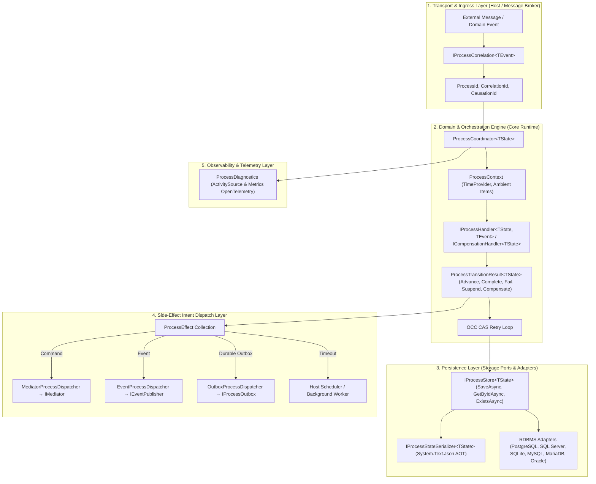
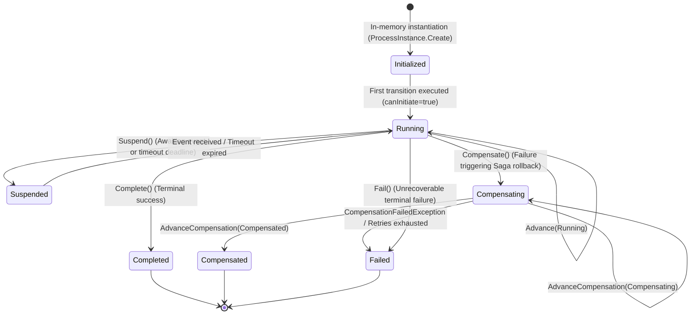
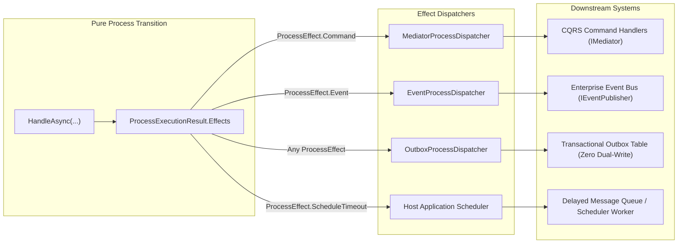
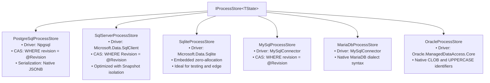
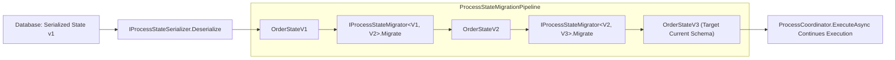

# Architecture & Diagrams — EricksonLopez.Processes

Technical documentation and architectural diagrams for **EricksonLopez.Processes**, modeled rigorously from the library source code and verified against .NET 10 (C# Preview, Native AOT, and Trimming-safe).

---

## 1. Clean Architecture & System Layers



---

## 2. Component Dependency Graph


---

## 3. Finite State Machine Lifecycle (`ProcessStatus`)



> **Terminal States**: `Completed`, `Compensated`, and `Failed`. Once an instance reaches a terminal state, the coordinator rejects any subsequent transition by throwing `InvalidProcessTransitionException`.

---

## 4. OCC CAS Execution Sequence

```mermaid
sequenceDiagram
    autonumber
    participant Host as Host Application
    participant Coord as ProcessCoordinator&lt;TState&gt;
    participant Store as IProcessStore&lt;TState&gt;
    participant Handler as IProcessHandler&lt;TState, TEvent&gt;
    participant Diag as ProcessDiagnostics

    Host->>Coord: ExecuteAsync(handler, correlation, event, canInitiate)
    loop OCC Retries (up to MaxConcurrencyRetries)
        Coord->>Store: GetByIdAsync(processId, ct)
        Store-->>Coord: ProcessInstance&lt;TState&gt;?
        alt Instance not found and canInitiate == false
            Coord-->>Host: throw ProcessNotFoundException
        else Instance loaded or created
            Coord->>Handler: HandleAsync(state, event, context)
            Handler-->>Coord: ProcessTransitionResult&lt;TState&gt;
            Coord->>Store: SaveAsync(instanceWithNextRevision, ct)
            alt SaveAsync returns Success
                Store-->>Coord: ProcessSaveResult.Success
                Coord->>Diag: RecordTransitionDuration(...)
                Coord-->>Host: ProcessExecutionResult&lt;TState&gt; (Instance, Effects)
            else SaveAsync returns ConcurrencyConflict
                Store-->>Coord: ProcessSaveResult.ConcurrencyConflict
                Coord->>Diag: RecordConcurrencyConflict(...)
                Note over Coord: Linear backoff delay (InitialBackoffDelay * attempt)
            else SaveAsync returns PersistenceError or NotFound
                Store-->>Coord: PersistenceError / NotFound
                Coord-->>Host: Returns ProcessExecutionResult with corresponding SaveResult
            end
        end
    end
    Note over Coord: If OCC retries exhausted → throw ConcurrencyConflictException
```

---

## 5. Reverse-Order LIFO Saga Compensation Flow

```mermaid
sequenceDiagram
    autonumber
    participant Coord as ProcessCoordinator&lt;TState&gt;
    participant Engine as SagaCompensationEngine
    participant Saga as ISaga&lt;TState&gt; &amp; ICompensationHandler&lt;TState&gt;
    participant Store as IProcessStore&lt;TState&gt;

    Note over Coord: Failure event received → HandleAsync yields Compensate()
    Coord->>Engine: CompensateAsync(processId, recordedCompensations, saga, ct)
    Note over Engine: Inverts compensation history stack (LIFO order)
    loop For each CompensationStep in reverse LIFO order
        Engine->>Saga: CompensateAsync(state, action, context)
        Saga-->>Engine: ProcessTransitionResult&lt;TState&gt;.Advance(Compensating, effects)
        Engine->>Store: SaveAsync(instance in Compensating status)
    end
    Note over Engine: All compensation steps executed successfully
    Engine->>Store: SaveAsync(instance in Compensated status)
    Engine-->>Coord: ProcessExecutionResult (Status = Compensated)
```

---

## 6. Decoupled Side-Effect Intent Dispatching



---

## 7. Relational Persistence Adapters and CAS Dialects



---

## 8. State Schema Migration Pipeline


