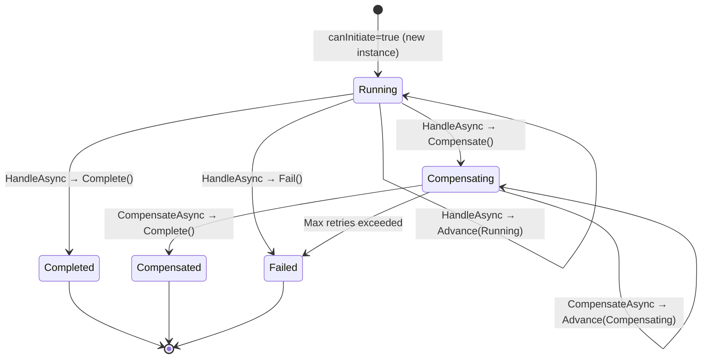
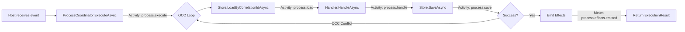
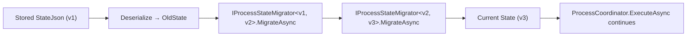

# Architecture & Diagrams — EricksonLopez.Processes

Visual reference for the `EricksonLopez.Processes` package architecture: package boundaries, the OCC execution loop, the FSM lifecycle, and the telemetry flow. All diagrams are derived from and verified against the current source code.

---

## Package Dependency Graph

```mermaid
graph TD
    subgraph "Tier 0 — Zero Dependencies"
        ABS["EricksonLopez.Processes.Abstractions<br/>(net10.0 + netstandard2.0)"]
    end

    subgraph "Tier 1 — Core Runtime"
        CORE["EricksonLopez.Processes<br/>(net10.0)"]
        GEN["EricksonLopez.Processes.Generator<br/>(netstandard2.0)"]
        ANA["EricksonLopez.Processes.Analyzers<br/>(netstandard2.0)"]
    end

    subgraph "Tier 2 — Infrastructure"
        DI["EricksonLopez.Processes.DependencyInjection<br/>(net10.0)"]
        STJ["EricksonLopez.Processes.SystemTextJson<br/>(net10.0)"]
        TST["EricksonLopez.Processes.Testing<br/>(net10.0)"]
    end

    subgraph "Tier 3 — Effect Dispatchers"
        EVT["EricksonLopez.Processes.Events<br/>(net10.0)"]
        MED["EricksonLopez.Processes.Mediator<br/>(net10.0)"]
        OBX["EricksonLopez.Processes.Outbox<br/>(net10.0)"]
    end

    subgraph "Tier 4 — Storage Adapters"
        PG["Storage.PostgreSql"]
        SS["Storage.SqlServer"]
        SL["Storage.Sqlite"]
        MY["Storage.MySql"]
        MA["Storage.MariaDb"]
        OR["Storage.Oracle"]
    end

    ABS --> CORE
    ABS --> DI
    ABS --> STJ
    ABS --> TST
    ABS --> EVT
    ABS --> MED
    ABS --> OBX
    ABS --> PG
    ABS --> SS
    ABS --> SL
    ABS --> MY
    ABS --> MA
    ABS --> OR
    CORE --> DI
    CORE --> EVT
    CORE --> MED
    CORE --> OBX
```



---

## Process Lifecycle State Machine (FSM)



> **Terminal states**: `Completed`, `Compensated`, `Failed` — once reached, the coordinator will not accept further event messages.

---

## OCC Execution Loop — `ProcessCoordinator<TState>.ExecuteAsync`

```mermaid
sequenceDiagram
    participant Host
    participant Coordinator as ProcessCoordinator&lt;TState&gt;
    participant Store as IProcessStore&lt;TState&gt;
    participant Handler as IProcessHandler&lt;TState,TEvent&gt;
    participant Serializer as IProcessStateSerializer

    Host->>Coordinator: ExecuteAsync(handler, correlation, event)
    loop OCC Retry (max: MaxConcurrencyRetries)
        Coordinator->>Store: LoadByCorrelationIdAsync(correlationId, processType)
        Store-->>Coordinator: ProcessStateRecord? (null if new)
        Coordinator->>Serializer: Deserialize<TState>(StateJson)
        Serializer-->>Coordinator: TState
        Coordinator->>Handler: HandleAsync(state, event, context)
        Handler-->>Coordinator: ProcessTransitionResult<TState>
        Coordinator->>Serializer: Serialize<TState>(newState)
        Serializer-->>Coordinator: StateJson
        Coordinator->>Store: SaveAsync(ProcessStateRecord)
        alt Save succeeded
            Store-->>Coordinator: ProcessSaveResult.Success
            Coordinator-->>Host: ProcessExecutionResult{Instance, Effects}
        else OCC Conflict
            Store-->>Coordinator: ProcessSaveResult.Conflict
            Note over Coordinator: Backoff (exponential) → retry
        end
    end
    Note over Coordinator: If all retries fail → throw ConcurrencyConflictException
```

---

## Compensation (LIFO) Flow

```mermaid
sequenceDiagram
    participant Coordinator
    participant Handler as ISaga&lt;TState&gt; + ICompensationHandler&lt;TState&gt;
    participant Engine as SagaCompensationEngine

    Note over Coordinator: Trigger event received → HandleAsync → Compensate()
    Coordinator->>Engine: ExecuteCompensationAsync(compensationActions, state)
    loop For each CompensationAction (LIFO order)
        Engine->>Handler: CompensateAsync(state, action, context)
        Handler-->>Engine: ProcessTransitionResult<TState>.Advance(Compensating)
    end
    Engine-->>Coordinator: Final state (Compensated or Failed)
```

---

## OpenTelemetry Tracing — `ProcessDiagnostics`



**Activity Source Name**: `EricksonLopez.Processes`

**Measured metrics** (via `System.Diagnostics.Metrics.Meter`):

| Metric | Unit | Description |
| :--- | :--- | :--- |
| `process.executions.total` | `count` | Total `ExecuteAsync` calls. |
| `process.occ.retries` | `count` | OCC retry attempts. |
| `process.effects.emitted` | `count` | Total side-effect intents emitted. |
| `process.execution.duration` | `ms` | End-to-end coordinator execution time. |

---

## State Migration Pipeline



`ProcessStateMigrationPipeline<TState>` is automatically applied by `ProcessCoordinator` when the persisted `Version` is lower than the current process `Version`. Each migration step is registered via DI.

---

## Clean Architecture Boundary

```
┌─────────────────────────────────────────────────────────────────────┐
│  APPLICATION LAYER                                                   │
│  Host / Infrastructure                                               │
│  ┌──────────┐  ┌──────────────┐  ┌──────────┐  ┌─────────────────┐│
│  │ Transport│  │ Scheduler    │  │ Store    │  │ Effect Consumer ││
│  │ (Broker) │  │ (Hangfire,…) │  │ Adapter  │  │ (Mediator,Outbox││
│  └────┬─────┘  └──────────────┘  └────┬─────┘  └────────────────-┘│
│       │                                │                             │
├───────▼────────────────────────────────▼─────────────────────────── ┤
│  DOMAIN LAYER (EricksonLopez.Processes)                              │
│  ┌──────────────────────┐   ┌───────────────────────────────────┐  │
│  │ IProcessHandler<S,E> │   │ ProcessCoordinator<TState>        │  │
│  │ ICompensationHandler │   │ ProcessTransitionResult<TState>   │  │
│  │ ISaga<TState>        │   │ SagaCompensationEngine            │  │
│  └──────────────────────┘   └───────────────────────────────────┘  │
├────────────────────────────────────────────────────────────────────  ┤
│  CONTRACTS LAYER (EricksonLopez.Processes.Abstractions)              │
│  IProcessState | IProcessStore | IProcessCorrelation                 │
│  ProcessId | CorrelationId | Revision | ProcessEffect                │
└─────────────────────────────────────────────────────────────────────┘
```

The **Abstractions** package has **zero external dependencies**. The core library depends only on Abstractions. All infrastructure (database drivers, serializers, brokers) lives outside the domain boundary.
