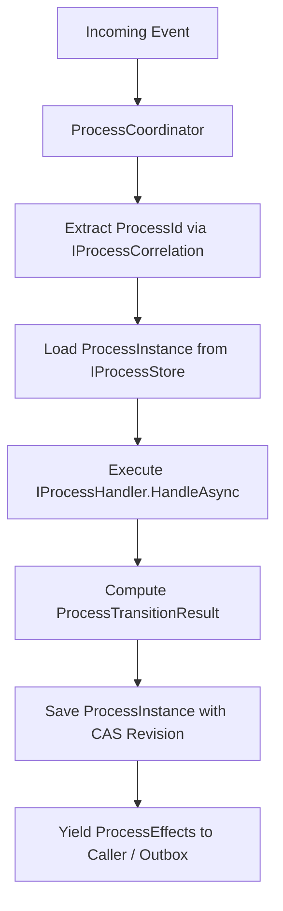

# Architecture Overview — EricksonLopez.Processes

## Core Design Principles

`EricksonLopez.Processes` is built upon the following architectural foundations:

1. **AOT-First & Trimming-First**: Zero dynamic code generation, zero unannotated reflection, zero `Activator.CreateInstance`.
2. **State Hydration Lifecycle**: Processes do not hold long-running threads or in-memory state machines. State is loaded on demand from `IProcessStore<TState>`, mutated deterministically, committed with Optimistic Concurrency Control, and immediately evicted.
3. **Discrete Intent Emittance**: Transitions do not perform side-effects directly; they yield `ProcessEffect` intents (`Command`, `Event`, `ScheduleTimeout`, `Compensation`) to be executed reliably via transactional outboxes or mediators.
4. **Deterministic Versioning & Migration**: Explicit schema evolution via `IProcessStateMigrator<TFrom, TTo>` and concurrent execution of multiple process versions.

