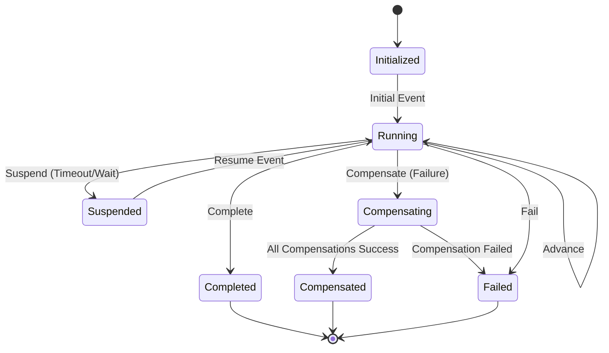

# Process Lifecycle & State Machine

## Process Status Transitions

A process lifecycle in `EricksonLopez.Processes` is governed by the `ProcessStatus` enumeration:

### Status Descriptions

- **`Initialized`**: Instance created, not yet advanced.
- **`Running`**: Active workflow executing forward steps.
- **`Suspended`**: Paused waiting for a temporal deadline (`ProcessEffect.ScheduleTimeout`) or external callback.
- **`Completed`**: Successfully reached its terminal milestone.
- **`Compensating`**: Rollback in progress across recorded steps.
- **`Compensated`**: All compensations succeeded. Terminal state.
- **`Failed`**: Terminal failure (unrecoverable error or compensation failure).
