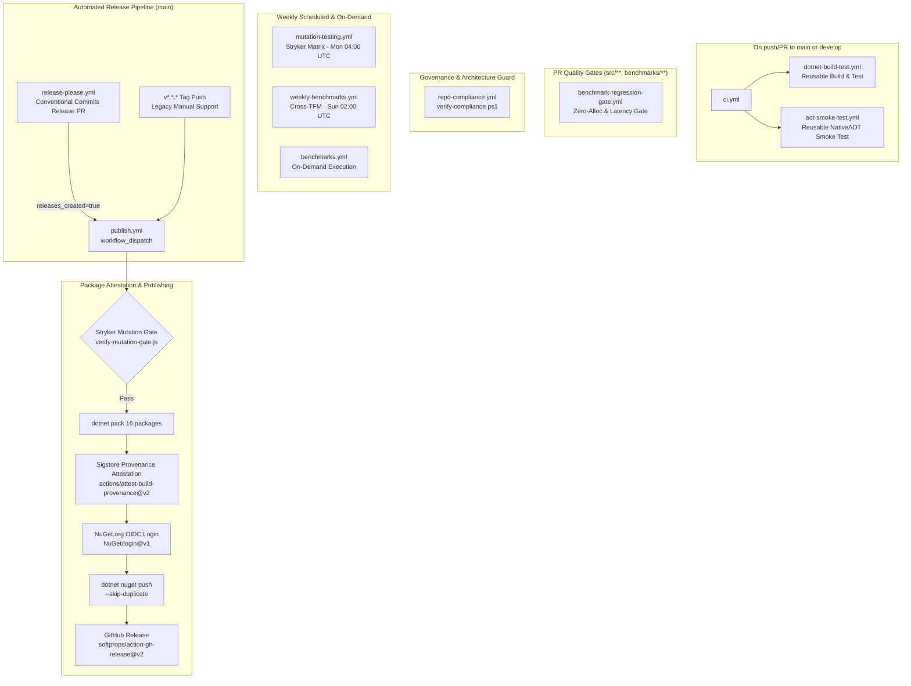

# CI/CD and Quality Engineering Guide — EricksonLopez.Processes

Comprehensive documentation of the GitHub Actions automation pipelines, quality gates, mutation testing thresholds, and release strategy for `EricksonLopez.Processes`. All information is derived from the actual workflow files in `.github/workflows/`.

---

## 1. Workflow Architecture Overview



---

## 2. Complete Workflow Inventory & Specifications

| # | Pipeline Name | Workflow File | Triggers | Primary Purpose |
|---|---|---|---|---|
| 1 | **Continuous Integration** | `ci.yml` | `push`, `pull_request` (`main`, `develop`) | Orchestrates build, tests, coverage, and NativeAOT verification. |
| 2 | **Reusable Build & Test** | `dotnet-build-test.yml` | `workflow_call` | Restores SNK, executes Release build, Coverlet test coverage, and SonarCloud analysis. |
| 3 | **NativeAOT Smoke Test** | `aot-smoke-test.yml` | `push`, `pull_request` (`main`, `develop`), `workflow_call`, `workflow_dispatch` | Compiles and executes `NativeAotSample` with `PublishAot=true` on Linux. |
| 4 | **Benchmark Regression Gate** | `benchmark-regression-gate.yml` | `pull_request` (`main`, `develop` for `src/**`, `benchmarks/**`), `workflow_dispatch` | Enforces zero-allocation hotpath and <= 5% latency regression. |
| 5 | **Publish NuGet** | `publish.yml` | `workflow_dispatch` (from Release Please), `push` (`v*.*.*` tags) | Packs, attests with Sigstore, authenticates via OIDC, and publishes 16 packages to NuGet.org. |
| 6 | **Release Please** | `release-please.yml` | `push` (`main`) | Automates Conventional Commits release PRs and triggers `publish.yml`. |
| 7 | **Mutation Testing** | `mutation-testing.yml` | Schedule (`0 4 * * 1`), `workflow_call`, `workflow_dispatch` | Runs Stryker.NET mutation testing across all 16 package components. |
| 8 | **Benchmarks** | `benchmarks.yml` | `workflow_call`, `workflow_dispatch` | Executes on-demand BenchmarkDotNet suites and uploads markdown summaries. |
| 9 | **Weekly Benchmarks** | `weekly-benchmarks.yml` | Schedule (`0 2 * * 0`), `workflow_dispatch` | Runs multi-TFM benchmarks (.NET 8, 9, 10) and commits baseline results. |
| 10 | **Repo Compliance** | `repo-compliance.yml` | `push`, `pull_request` (`main`), `workflow_dispatch` | Runs `scripts/verify-compliance.ps1` to enforce architectural and governance invariants. |

---

## 3. Detailed Workflow Specifications

### 3.1 Continuous Integration — `ci.yml`
- **Triggers**: `push` and `pull_request` to `main` and `develop`.
- **Jobs**:
  - `build-and-test`: Invokes reusable `dotnet-build-test.yml` with `artifact-name: test-results`.
  - `aot-smoke-test`: Invokes reusable `aot-smoke-test.yml`.
- **Secrets Forwarded**: `SNK_KEY`, `CODECOV_TOKEN`, `SONAR_TOKEN`.

### 3.2 Reusable Build & Test — `dotnet-build-test.yml`
- **Type**: Reusable workflow (`workflow_call`).
- **Runner**: `ubuntu-latest`.
- **Inputs**:
  - `dotnet-version` (string, default: `10.0.x`)
  - `test-filter` (string, default: `""`)
  - `test-project` (string, default: `""`)
  - `upload-coverage` (boolean, default: `true`)
  - `artifact-name` (string, default: `test-results`)
- **Execution Flow**:
  1. `actions/checkout@v4` with `fetch-depth: 0`.
  2. Setup .NET SDK `10.0.x`.
  3. Strong Name key decoding from `SNK_KEY` secret.
  4. Setup Java 17 (Zulu) for SonarScanner.
  5. Install and launch `dotnet-sonarscanner begin` (SonarCloud project: `ericksonlopezf_dotnet-processes`).
  6. `dotnet build EricksonLopez.Processes.slnx --configuration Release`.
  7. `dotnet test EricksonLopez.Processes.slnx --no-build --configuration Release` collecting OpenCover and Cobertura coverage.
  8. `dotnet-sonarscanner end`.
  9. Upload test results `.trx` artifacts.
  10. Upload coverage report via `codecov/codecov-action@v5` (token: `CODECOV_TOKEN`, flags: `unittests`).

### 3.3 NativeAOT Smoke Test — `aot-smoke-test.yml`
- **Type**: Standalone / reusable workflow.
- **Prerequisites**: Installs native dependencies on Ubuntu (`clang`, `lld`, `zlib1g-dev`).
- **Compilation**:
  ```bash
  dotnet publish samples/NativeAotSample/NativeAotSample.csproj \
    --configuration Release \
    --runtime linux-x64 \
    --self-contained \
    -p:PublishAot=true \
    -p:TreatWarningsAsErrors=true \
    -p:WarningLevel=5 \
    --output ./aot-output
  ```
- **Execution Validation**: Executes `./aot-output/NativeAotSample` and verifies zero exit code.

### 3.4 Benchmark Regression Gate — `benchmark-regression-gate.yml`
- **Trigger**: Pull requests affecting `src/**` or `benchmarks/**`.
- **Harness**: BenchmarkDotNet short job exporting JSON.
- **Validation**: Executes `scripts/verify-benchmark-gate.ps1`:
  - **Zero Allocation Invariant**: Ensures `0 B` heap allocation on core identifier and coordinator combinators.
  - **Latency Regression Threshold**: Fails the PR if mean latency regresses by more than **5%** vs baseline (`benchmarks/results/baseline.json`).

### 3.5 Publish NuGet — `publish.yml`
- **Permissions**: `id-token: write`, `contents: write`, `attestations: write`, `statuses: read`, `actions: read`.
- **Quality Gates Before Publish**:
  1. `mutation-gate-check`: Evaluates `scripts/verify-mutation-gate.js` against commit statuses.
  2. `stryker-gate`: Conditionally executes `mutation-testing.yml` if mutation gate needs refreshing.
  3. Full solution test execution with coverage uploaded to Codecov (`flags: publish-gate`).
- **Packaging**: Packs all 16 library `.csproj` files individually with `-p:VersionPrefix=$VERSION` into `./nupkgs/`.
- **Provenance Attestation**: Generates Sigstore provenance attestation (`actions/attest-build-provenance@v2`).
- **OIDC Publishing**: Authenticates to NuGet.org via short-lived OIDC exchange (`NuGet/login@v1`, user: `ericksonlopezf`) and pushes packages with `--skip-duplicate`.
- **GitHub Release**: Creates formal release with package inventory table (`softprops/action-gh-release@v2`).

### 3.6 Release Please — `release-please.yml`
- **Trigger**: Direct push or merged PR to `main`.
- **Mechanism**: Evaluates Conventional Commits history using `.release-please-config.json` and `.release-please-manifest.json`.
- **Dispatch**: Upon release creation, invokes `publish.yml` via GitHub REST API `actions.createWorkflowDispatch` passing the resolved version.

### 3.7 Mutation Testing — `mutation-testing.yml`
- **Schedule**: Every Monday at 04:00 UTC (`0 4 * * 1`) and manual dispatch.
- **Matrix**: 16 parallel matrix jobs corresponding to each `stryker-*.json` configuration file.
- **Threshold Policy**:
  - `High` ($\ge 100\%$): High target standard.
  - `Low` ($\ge 98\%$): Acceptable standard.
  - `Break` ($< 95\%$): Hard quality gate failure (Stryker non-zero exit code).

---

## 4. Quality Gates & Enforcement

| Quality Gate | Tooling / Mechanism | Target Standard | Break Threshold | Enforced In |
|---|---|:---:|:---:|---|
| **Build Warnings** | Roslyn / MSBuild | 0 warnings | Any warning (`TreatWarningsAsErrors=true`) | All workflows |
| **Line Coverage** | Coverlet + Codecov | 100% | < 95% | `dotnet-build-test.yml`, `publish.yml` |
| **Branch Coverage** | Coverlet + Codecov | 100% | < 95% | `dotnet-build-test.yml`, `publish.yml` |
| **Mutation Score** | Stryker.NET | 100% | < 95% | `mutation-testing.yml`, `publish.yml` |
| **Hotpath Allocation** | BenchmarkDotNet | 0 B | > 0 B on hotpath | `benchmark-regression-gate.yml` |
| **Latency Regression** | BenchmarkDotNet | 0% | > 5% vs baseline | `benchmark-regression-gate.yml` |
| **Native AOT Safety** | ILC / AOT Analyzer | 0 warnings | Any IL2026/IL3050 warning | `aot-smoke-test.yml` |
| **Vulnerability Audit** | MSBuild NuGetAudit | 0 vulnerabilities | Any known vulnerability | All builds (`NuGetAudit=true`) |
| **Dependency Scanning** | Dependabot | Automated PRs | Vulnerability alert / PR | `.github/dependabot.yml` |

---

## 5. Branch & Versioning Strategy

- **`main`**: Protected production branch. All merges trigger `release-please.yml` and produce releases when conventional changes are detected.
- **`develop`**: Active integration branch. Validated continuously by `ci.yml`, `repo-compliance.yml`, and `aot-smoke-test.yml`.
- **Versioning**: Strict Semantic Versioning (SemVer 2.0.0). Pre-releases contain hyphenated identifiers (e.g. `1.0.0-rc1`) and are tagged automatically as pre-releases.

---

## 6. Supply Chain Security

| Control | Mechanism | Verification |
|---|---|---|
| **Sigstore Provenance** | `actions/attest-build-provenance@v2` | Cryptographically signed build attestation verifiable via GitHub CLI and cosign. |
| **NuGet OIDC Publishing** | `NuGet/login@v1` | Short-lived OIDC tokens replace long-lived static API keys. |
| **Strong Name Signing** | RSA-2048 (`EricksonLopez.snk`) | Verified during build; public key embedded in `Directory.Build.props`. |
| **Continuous Audit** | MSBuild NuGetAudit | `<NuGetAuditMode>all</NuGetAuditMode>`, `<NuGetAuditLevel>low</NuGetAuditLevel>`. |
| **Automated Dependency Updates** | GitHub Dependabot (`.github/dependabot.yml`) | Weekly updates for NuGet CPM (`Directory.Packages.props`) and GitHub Actions. |
| **SourceLink & Symbols** | Microsoft.SourceLink.GitHub | Symbol packages (`.snupkg`) embedded with source repository commit hashes. |
| **Deterministic Builds** | MSBuild `<Deterministic>true</Deterministic>` | Byte-for-byte binary reproducibility across build environments. |

---

## 7. Required Repository Secrets

| Secret | Scope | Usage |
|---|---|---|
| `SNK_KEY` | Repository Secret | Base64-encoded RSA strong name signing key used on clean CI runners. |
| `CODECOV_TOKEN` | Repository Secret | Authentication token for uploading coverage reports to Codecov.io. |
| `SONAR_TOKEN` | Repository Secret | Authentication token for SonarCloud static analysis. |
| `GITHUB_TOKEN` | Built-in Runner Secret | Used by Release Please and workflow dispatch triggers. |
