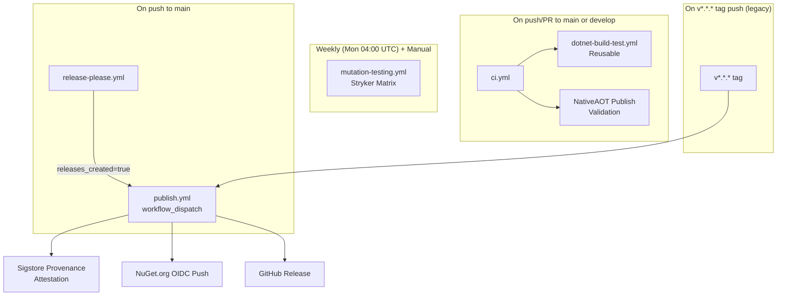
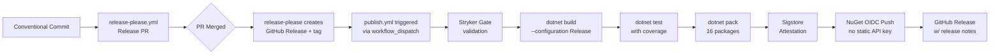

# CI/CD and Quality Engineering Guide — EricksonLopez.Processes

Comprehensive documentation of the GitHub Actions automation pipelines, quality gates, mutation testing thresholds, and release strategy for `EricksonLopez.Processes`. All information is derived from the actual workflow files in `.github/workflows/`.

---

## 1. Workflow Overview

---

## 2. Workflow Specifications

### 2.1 Continuous Integration — `ci.yml`

- **Trigger**: `push` or `pull_request` on branches `main`, `develop`
- **Runner**: `ubuntu-latest`
- **Jobs**:
  - **`build-and-test`**: Calls reusable `dotnet-build-test.yml` with `artifact-name: test-results`
  - **`aot-gate`**: Runs Native AOT publish validation on `ubuntu-latest`
- **Secrets passed**: `SNK_KEY`, `CODECOV_TOKEN`, `SONAR_TOKEN`

**AOT Gate steps**:
1. `actions/checkout@v4`
2. Setup .NET 10.0.x
3. `dotnet restore EricksonLopez.Processes.slnx`
4. `dotnet publish samples/NativeAotSample/NativeAotSample.csproj -c Release -p:PublishAot=true`

---

### 2.2 Reusable Build & Test — `dotnet-build-test.yml`

- **Type**: Reusable workflow (`workflow_call`)
- **Runner**: `ubuntu-latest`
- **Inputs**:
  | Input | Type | Default | Description |
  | :--- | :--- | :--- | :--- |
  | `dotnet-version` | `string` | `10.0.x` | .NET SDK version |
  | `test-filter` | `string` | `""` | Test filter expression |
  | `test-project` | `string` | `""` | Specific project path |
  | `upload-coverage` | `boolean` | `true` | Upload Codecov artifacts |
  | `artifact-name` | `string` | `test-results` | Artifact name for test results |
- **Secrets**:
  | Secret | Required | Description |
  | :--- | :--- | :--- |
  | `SNK_KEY` | No | Base64-encoded `.snk` Strong Name key |
  | `CODECOV_TOKEN` | No | Codecov upload token |
  | `SONAR_TOKEN` | No | SonarCloud analysis token |
- **Steps**:
  1. Checkout with `fetch-depth: 0`
  2. Setup .NET (uses `inputs.dotnet-version`)
  3. Restore Strong Name key from `SNK_KEY` secret (base64 decode)
  4. Setup Java 17 (Zulu) for SonarScanner
  5. Install `dotnet-sonarscanner` (if `SONAR_TOKEN` is set)
  6. Begin SonarCloud analysis (conditional on `SONAR_TOKEN`)
  7. `dotnet build EricksonLopez.Processes.slnx --configuration Release`
  8. `dotnet test` with `--collect:\"XPlat Code Coverage\"` (opencover + cobertura formats)
  9. End SonarCloud analysis
  10. Upload test results artifact
  11. Upload coverage to Codecov (`codecov/codecov-action@v4`)
- **Artifacts produced**: `test-results/` directory with `.trx` files and `coverage.opencover.xml`

---

### 2.3 Mutation Testing — `mutation-testing.yml`

- **Triggers**:
  - `workflow_dispatch` (manual, with `mutation-level: Basic | Standard | Advanced`)
  - `schedule`: Every Monday at 04:00 UTC (`0 4 * * 1`)
- **Runner**: `ubuntu-latest`
- **Concurrency**: `cancel-in-progress: true` per `mutation-testing-${{ github.ref }}`
- **Timeout**: 480 minutes per job
- **Strategy**: `fail-fast: false` matrix across all packages
- **Packages tested**: All 16 library packages via individual `stryker-*.json` configs

**Stryker Threshold Policy** (single source of truth in each `stryker-*.json`):

| Band | Threshold | Outcome |
| :--- | :--- | :--- |
| High | ≥ 100% | ✅ HIGH |
| Low | ≥ 98% | 🟡 LOW (warn) |
| Warning | ≥ 95% | 🟠 WARNING |
| Break | < 95% | ❌ FAILED (non-zero exit) |

---

### 2.4 Release Please — `release-please.yml`

- **Trigger**: `push` on branch `main`
- **Runner**: `ubuntu-latest`
- **Permissions**: `contents: write`, `pull-requests: write`
- **Steps**:
  1. `googleapis/release-please-action@v4` — creates or updates Release PR using `.release-please-config.json` and `.release-please-manifest.json`
  2. If `releases_created == 'true'`: triggers `publish.yml` via `workflow_dispatch` with the new `version` input
- **Version strategy**: Determined by Conventional Commits (`feat:`, `fix:`, `chore:`, etc.)

---

### 2.5 Publish NuGet — `publish.yml`

- **Triggers**:
  - `workflow_dispatch` (input: `version` — e.g., `1.2.3`)
  - `push` with tag matching `v*.*.*` (legacy manual tag support)
- **Runner**: `ubuntu-latest`
- **Permissions**: `id-token: write`, `contents: write`, `attestations: write`, `statuses: read`, `actions: read`
- **Secrets required**: `SNK_KEY`, `CODECOV_TOKEN`
- **Steps**:
  1. Checkout with `fetch-depth: 0`
  2. Resolve version (priority: `workflow_dispatch` input → git tag → `Directory.Build.props`)
  3. **Validate Stryker Mutation Quality Gate** via `scripts/verify-mutation-gate.js`
  4. Setup .NET 10.0.x
  5. Restore Strong Name key from `SNK_KEY`
  6. `dotnet restore`
  7. `dotnet build --configuration Release`
  8. `dotnet test --configuration Release` (with coverage)
  9. Upload coverage to Codecov (`codecov/codecov-action@v5`, flags: `publish-gate`)
  10. `dotnet pack` — all 16 packages individually with `-p:VersionPrefix=$VERSION`
  11. **Sigstore Provenance Attestation** (`actions/attest-build-provenance@v2`)
  12. **NuGet OIDC Login** (`NuGet/login@v1`) — no static API key
  13. `dotnet nuget push ./nupkgs/*.nupkg --skip-duplicate`
  14. Create GitHub Release (tag-triggered only) with `softprops/action-gh-release@v2`
- **Pre-release detection**: `prerelease: ${{ contains(steps.version.outputs.VERSION, '-') }}`
- **Artifacts produced**: 16 `.nupkg` + 16 `.snupkg` files in `./nupkgs/`

---

## 3. Build Process Pipeline

---

## 4. Quality Gates

### Code Coverage

- **Tool**: Coverlet (`--collect:\"XPlat Code Coverage\"`)
- **Formats**: OpenCover + Cobertura
- **Reporting**: Codecov (`codecov/codecov-action`) — token via `CODECOV_TOKEN` secret
- **Standard**: 100% Line, Branch, and Method coverage across all runtime packages
- **Gate on publish**: Coverage upload is also run in `publish.yml` before packing

### Mutation Testing (Stryker.NET)

- **Configs**: Per-package `stryker-*.json` files in repository root:
  - `stryker-config.json` (core)
  - `stryker-abstractions-config.json`
  - `stryker-analyzers-config.json`
  - `stryker-dependencyinjection-config.json`
  - `stryker-events-config.json`
  - `stryker-generator-config.json`
  - `stryker-mediator-config.json`
  - `stryker-outbox-config.json`
  - `stryker-storagemariadb-config.json`
  - `stryker-storagemysql-config.json`
  - `stryker-storageoracle-config.json`
  - `stryker-storagepostgresql-config.json`
  - `stryker-storagesqlite-config.json`
  - `stryker-storagesqlserver-config.json`
  - `stryker-systemtextjson-config.json`
  - `stryker-testing-config.json`
- **Thresholds**: high=100, low=98, break=95
- **Gate**: `publish.yml` calls `scripts/verify-mutation-gate.js` before packing

### Static Analysis (SonarCloud)

- **Tool**: `dotnet-sonarscanner` + `actions/setup-java@v3` (Java 17 Zulu)
- **Organization**: `ericksonlopezf` on `sonarcloud.io`
- **Project key**: `ericksonlopezf_dotnet-processes`
- **Coverage input**: `**/coverage.opencover.xml`
- **Secret**: `SONAR_TOKEN`
- **Exclusions**: `samples/**`, `benchmarks/**`, `scripts/**`, generators, analyzers

### Native AOT Gate

- Enabled via `Directory.Build.props` for all `net8.0`+ targets:
  - `<IsAotCompatible>true</IsAotCompatible>`
  - `<EnableTrimAnalyzer>true</EnableTrimAnalyzer>`
  - `<EnableSingleFileAnalyzer>true</EnableSingleFileAnalyzer>`
  - `<EnableAotAnalyzer>true</EnableAotAnalyzer>`
- `TreatWarningsAsErrors=true` means zero trim/AOT warnings allowed at build time
- `ci.yml` `aot-gate` job publishes `NativeAotSample` on every CI run

---

## 5. Branch Strategy

Based on workflow triggers:

| Branch | CI Trigger | Notes |
| :--- | :--- | :--- |
| `main` | `ci.yml` (push + PR) | Protected; requires passing CI |
| `develop` | `ci.yml` (push + PR) | Integration branch |
| `release-please--...` | Managed by `release-please.yml` | Auto-created release PRs |

> No `hotfix/*`, `feature/*`, or `release/*` branches are explicitly named in workflow triggers.

---

## 6. Release Strategy

- **Versioning**: Semantic Versioning via `release-please` + Conventional Commits
- **Version source**: `VersionPrefix` in `Directory.Build.props` (current: `1.0.0`)
- **Tag format**: `v*.*.*` (e.g., `v1.2.3`)
- **Pre-release**: Package version containing `-` is marked `prerelease: true` in GitHub Release
- **Publishing**: NuGet OIDC (Trusted Publishing via `NuGet/login@v1`) — no static API key stored in secrets
- **Skip duplicates**: `--skip-duplicate` prevents overwrite of existing versions

---

## 7. Supply Chain Security

| Control | Implementation |
| :--- | :--- |
| **Sigstore Provenance Attestation** | `actions/attest-build-provenance@v2` on every `publish.yml` run |
| **NuGet Trusted Publishing (OIDC)** | `NuGet/login@v1` — OIDC token exchange, no static `NUGET_API_KEY` in repository secrets |
| **Strong Name Signing** | `SNK_KEY` secret (base64-encoded `.snk`); decoded during build; `EricksonLopez.Processes.snk` never committed |
| **SourceLink** | `<PublishRepositoryUrl>true</PublishRepositoryUrl>` — source-to-binary mapping |
| **Deterministic Builds** | `<Deterministic>true</Deterministic>` — reproducible compilation artifacts |
| **Symbol Packages** | `<IncludeSymbols>true</IncludeSymbols>` + `<SymbolPackageFormat>snupkg</SymbolPackageFormat>` |
| **Mutation Gate on Publish** | `scripts/verify-mutation-gate.js` blocks publish if Stryker score < threshold |

---

## 8. Dependency Scanning

Configured via `.github/dependabot.yml` (not documented here per policy — configuration is infrastructure, not documentation). The file monitors NuGet ecosystem dependencies for security updates.

---

## 9. Required Secrets

| Secret | Used By | Description |
| :--- | :--- | :--- |
| `SNK_KEY` | `dotnet-build-test.yml`, `publish.yml` | Base64-encoded Strong Name key |
| `CODECOV_TOKEN` | `dotnet-build-test.yml`, `publish.yml` | Codecov upload token |
| `SONAR_TOKEN` | `dotnet-build-test.yml` | SonarCloud analysis token |
| `GITHUB_TOKEN` | `release-please.yml`, `publish.yml` | Built-in — no configuration needed |
