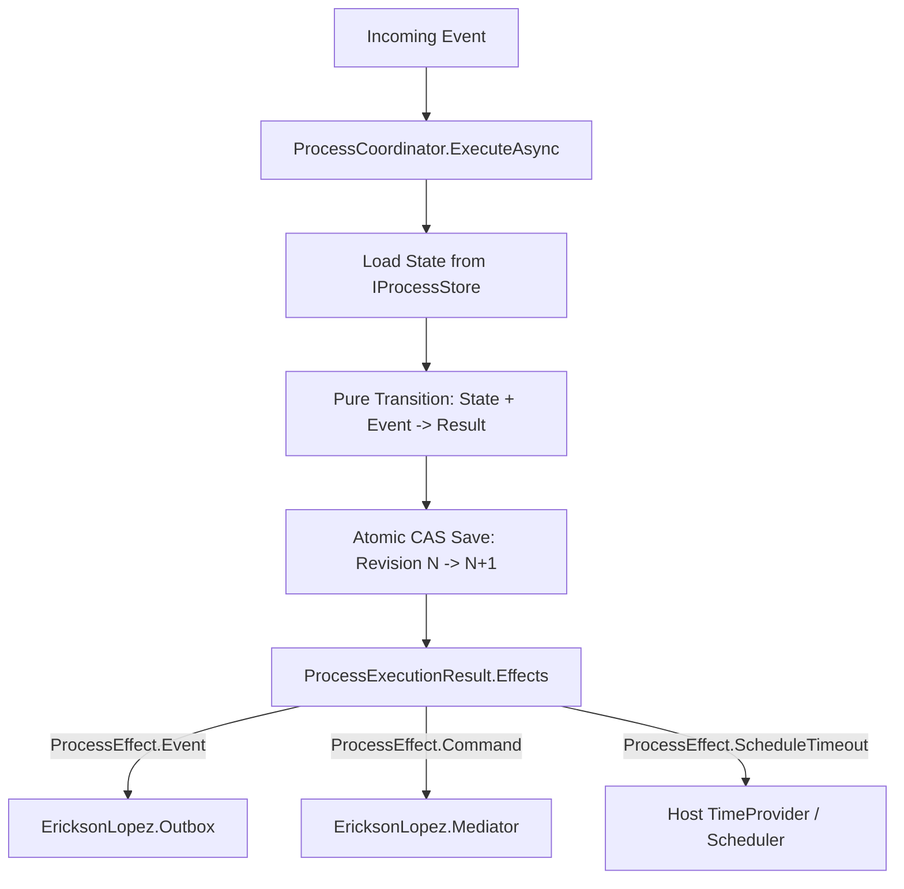

# Outbox and EventBus Integration with ProcessEffect

Design pattern and architecture guide for connecting pure side-effect intents emitted by `EricksonLopez.Processes` (`ProcessEffect`) to `EricksonLopez.Outbox`, `EricksonLopez.Events`, and `EricksonLopez.Mediator`.

---

## 1. Pure Side-Effect Intents (*Pure Intents*)

In `EricksonLopez.Processes`, a process handler **never executes direct network I/O, publishes to message brokers, or executes HTTP API calls**.
Instead, state transitions yield an immutable list of declarative `ProcessEffect` records:

```csharp
public abstract record ProcessEffect
{
    public sealed record Command(object CommandPayload, string? CommandType = null) : ProcessEffect;
    public sealed record Event(object EventPayload, string? EventType = null) : ProcessEffect;
    public sealed record ScheduleTimeout(TimeSpan Delay, object TimeoutTrigger, string? TriggerType = null) : ProcessEffect;
    public sealed record Compensation(CompensationAction Action) : ProcessEffect;
}
```

---

## 2. Dispatching Emitted Effects

Once `ProcessCoordinator<TState>` completes and persists the state transition successfully under Optimistic Concurrency Control (OCC CAS), the application host dispatches the emitted intents:

```csharp
public sealed class ProcessEffectDispatcher
{
    private readonly IProcessOutboxDispatcher _outbox;
    private readonly IMediatorProcessDispatcher _mediator;

    public ProcessEffectDispatcher(
        IProcessOutboxDispatcher outbox,
        IMediatorProcessDispatcher mediator)
    {
        _outbox = outbox;
        _mediator = mediator;
    }

    public async ValueTask DispatchEffectsAsync(
        IReadOnlyList<ProcessEffect> effects,
        ProcessId processId,
        CancellationToken cancellationToken = default)
    {
        foreach (var effect in effects)
        {
            switch (effect)
            {
                case ProcessEffect.Event @event:
                    // Outbox transactional persistence for guaranteed delivery to Kafka/RabbitMQ
                    await _outbox.DispatchAsync(new[] { effect }, processId, cancellationToken);
                    break;

                case ProcessEffect.Command command:
                    // Dispatch command in-process via Mediator
                    await _mediator.DispatchAsync(new[] { effect }, processId, cancellationToken);
                    break;

                case ProcessEffect.ScheduleTimeout timeout:
                    // Scheduled on host timer scheduler or delayed queue
                    break;

                case ProcessEffect.Compensation compensation:
                    break;
            }
        }
    }
}
```

---

## 3. End-to-End Transactional Flow



---

## 4. Consistency & Dual-Write Avoidance

- **Dual-Write Avoidance**: Persisting side-effect intents into `EricksonLopez.Outbox` within the same database transaction as the process state prevents partial failure states.
- **Idempotency**: All emitted intents retain causation and correlation tokens derived from the execution `ProcessContext`.
