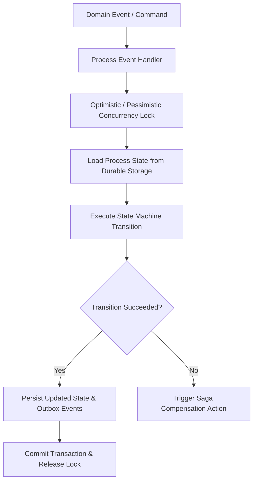

# Level 00: Architectural Introduction & Mental Model

## 1. Overview & Problem Statement
Long-running business transactions, saga orchestration, and multi-step distributed workflows in cloud applications frequently suffer from:
- **State Inconsistency**: Lack of durable state persistence across process crashes or pod restarts.
- **Race Conditions & Concurrency**: Uncontrolled concurrent transitions corrupting state machine invariants.
- **Heavyweight Framework Overhead**: Traditional workflow engines allocate heavily, rely on dynamic reflection, and fail under .NET Native AOT compilation.

`EricksonLopez.Processes` provides a lightweight, deterministic, zero-reflection **Durable State Machine & Saga Engine**:
- **Strict Invariant Validation**: State transitions are strongly typed records evaluated deterministically.
- **Pluggable Storage Drivers**: Native drivers for PostgreSQL, SQL Server, MySQL, MariaDB, Oracle, and SQLite.
- **100% Native AOT & Trimmable**: Zero runtime reflection, Native AOT smoke-tested across CI pipelines.

---

## 2. Process Execution Lifecycle

---

## 3. High-Level Comparison

| Capability | Generic State Machine Libraries | MassTransit / NServiceBus Sagas | EricksonLopez.Processes |
|---|---|---|---|
| **Durable Storage** | In-memory only | Framework coupled | **Pluggable Low-Overhead RDBMS Drivers** |
| **Concurrency Control** | Manual locking | Heavy saga locks | **Version-based Optimistic Concurrency Invariants** |
| **Native AOT Compatible** | ⚠️ Partial | ❌ Reflection heavy | ✅ **100% Guaranteed Native AOT** |
| **Memory Footprint** | Low | High | **Zero-Allocation Struct Transition Pipeline** |
