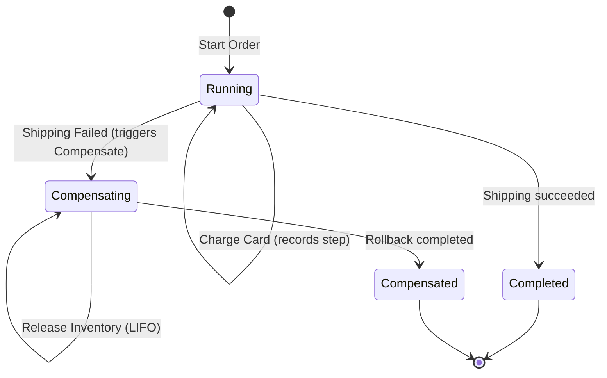

# Showcase — Level 03: Real-World Use Cases (Sagas & Complex Workflows)

**Level 03** implements two real-world enterprise architecture scenarios:
1. **Order Fulfillment Saga (`OrderFulfillmentSaga`)**: Multi-step distributed transaction (inventory reservation, credit card payment, shipment) with automatic rollback in strict reverse order (LIFO) upon failure.
2. **Invoice Certification Process Manager (`InvoiceCertificationProcess`)**: Multi-step process coordinating tax validation, withholding calculations, and electronic stamping.

---

## Covered Components

- `ISaga<TState>`: Compensatable saga contract.
- `ICompensationHandler<TState>`: Rollback executor implementing `CompensateAsync`.
- `CompensationStep.Create(...)`: Completed step record appended to the LIFO stack.
- `ProcessTransitionResult.Compensate(...)`: Initiates compensation passing `CompensationAction`.
- `ProcessTransitionResult.Compensated(...)`: Signals successful completion of all compensations.
- `ProcessStatus.Suspended`: Suspends process execution while awaiting external callbacks.
- `ProcessEffect.CreateTimeout(...)`: Schedules wake-up timers.

---

## Saga State Machine



---

## Showcase Execution

Executable code:
- `samples/EricksonLopez.Processes.Showcase/Level03_RealWorldUseCases/Level03OrderFulfillmentSagaDemo.cs`
- `samples/EricksonLopez.Processes.Showcase/Level03_RealWorldUseCases/Level03InvoiceCertificationProcessDemo.cs`

```bash
dotnet run --project samples/EricksonLopez.Processes.Showcase -- --level=3
```
