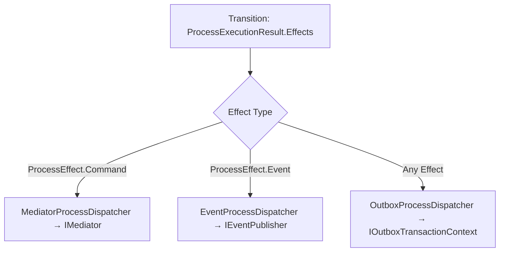

# Showcase — Level 04: Advanced Integration (Outbox, Mediator, Events)

**Level 04** demonstrates how to completely decouple state machine transitions from underlying transport technologies using official effect dispatchers.

---

## Covered Components

1. **Transactional Outbox (`EricksonLopez.Processes.Outbox`)**:
   - `IProcessOutboxDispatcher` and `OutboxProcessDispatcher`.
   - DI extension `services.AddProcessesOutbox()`.
   - Transactional dispatch of any `ProcessEffect` (`Command`, `Event`, `ScheduleTimeout`, `Compensation`) within the same database transaction, guaranteeing zero dual-write.

2. **In-Process Mediator (`EricksonLopez.Processes.Mediator`)**:
   - `IMediatorProcessDispatcher` and `MediatorProcessDispatcher`.
   - DI extension `services.AddProcessesMediator()`.
   - Dispatches `ProcessEffect.Command` intents directly to CQRS mediator handlers.
   - Callback `OnUnrecognizedPayload` to handle unrecognized command types without throwing exceptions.

3. **Event Bus (`EricksonLopez.Processes.Events`)**:
   - `IEventProcessDispatcher` and `EventProcessDispatcher`.
   - DI extension `services.AddProcessEventsDispatcher()`.
   - Publishes `ProcessEffect.Event` intents to the distributed messaging bus.

---

## Effect Dispatch Flow



---

## Showcase Execution

Executable code:
- `samples/EricksonLopez.Processes.Showcase/Level04_AdvancedIntegration/Level04OutboxIntegrationDemo.cs`
- `samples/EricksonLopez.Processes.Showcase/Level04_AdvancedIntegration/Level04MediatorIntegrationDemo.cs`
- `samples/EricksonLopez.Processes.Showcase/Level04_AdvancedIntegration/Level04EventsIntegrationDemo.cs`

```bash
dotnet run --project samples/EricksonLopez.Processes.Showcase -- --level=4
```
