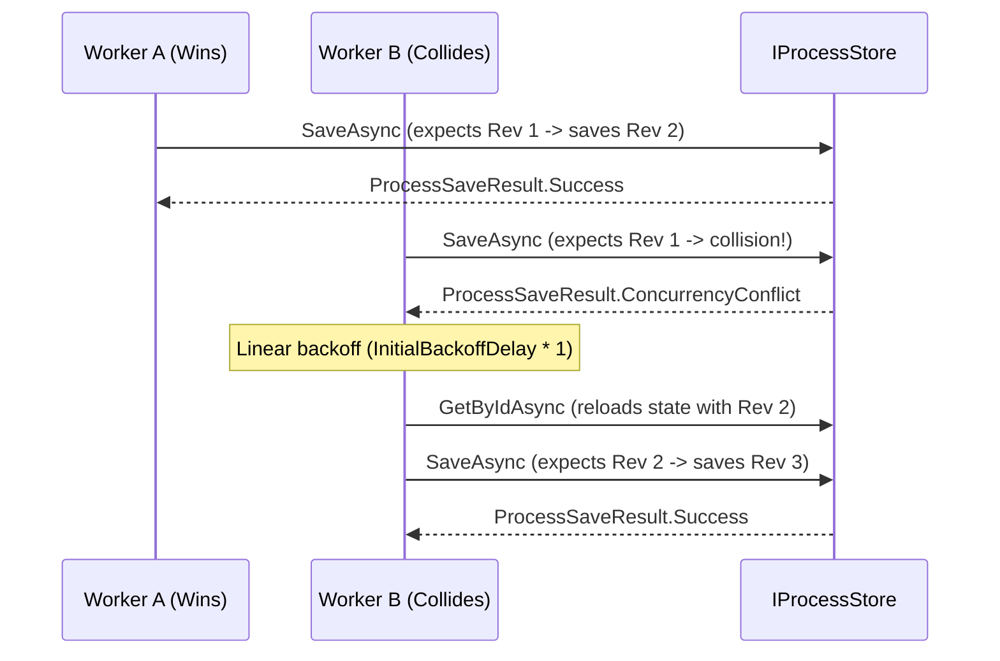

# Showcase — Level 05: Processing & Concurrency (OCC / CAS / Composite Keys / Effects)

**Level 05** explores in depth the mechanics of Optimistic Concurrency Control (OCC CAS), deterministic composite key generation, and exhaustive inspection of all `ProcessEffect` variants.

---

## Covered Components

1. **Optimistic Concurrency Control Loop (OCC CAS)**:
   - Monotonic `Revision` token.
   - `FaultInjectingProcessStore<TState>` to simulate concurrent CAS collisions on demand.
   - Linear backoff formula: `delay = InitialBackoffDelay * attempt`.
   - Automatic retry loop up to `MaxConcurrencyRetries` before raising `ConcurrencyConflictException`.

2. **Composite Correlation Keys**:
   - `CompositeCorrelationKey.From(...)` with 2, 3, or 4 parts.
   - Deterministic `CorrelationId` generation via SHA-256 hashing (UUIDv5) for atomic partition routing in distributed clusters.

3. **Complete Catalog of `ProcessEffect` Variants**:
   - `ProcessEffect.Command`: `GetPayload<T>()`, `TryGetPayload<T>()`.
   - `ProcessEffect.Event`: `GetPayload<T>()`, `TryGetPayload<T>()`.
   - `ProcessEffect.ScheduleTimeout`: `GetTrigger<T>()`, `TryGetTrigger<T>()`.
   - `ProcessEffect.Compensation`: `Action.ExtractPayload<T>()`.

---

## OCC Conflict Resolution Diagram



---

## Showcase Execution

Executable code:
- `samples/EricksonLopez.Processes.Showcase/Level05_ProcessingAndConcurrency/Level05ConcurrencyRetryDemo.cs`
- `samples/EricksonLopez.Processes.Showcase/Level05_ProcessingAndConcurrency/Level05CompositeKeyDemo.cs`
- `samples/EricksonLopez.Processes.Showcase/Level05_ProcessingAndConcurrency/Level05AllEffectsDemo.cs`

```bash
dotnet run --project samples/EricksonLopez.Processes.Showcase -- --level=5
```
