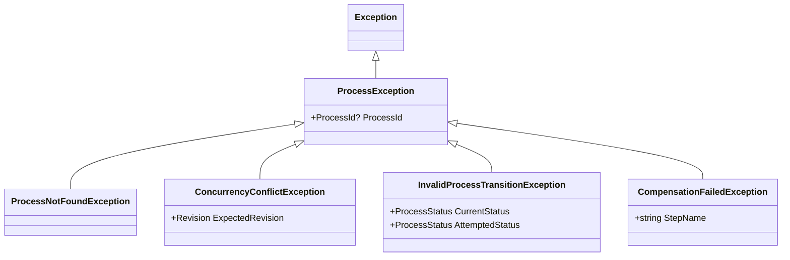

# Showcase — Level 06: Error Handling & Recovery

**Level 06** demonstrates the complete exception taxonomy of the library, the `ProcessSaveResult` enum values, and recovery mechanisms for compensation failures and invalid transitions.

---

## Covered Components

1. **Complete Exception Taxonomy**:
   - `ProcessException` (base class for all library exceptions).
   - `ProcessNotFoundException`: When an instance does not exist and `canInitiate == false`.
   - `ConcurrencyConflictException`: When OCC retries are exhausted.
   - `InvalidProcessTransitionException`: When an illegal state transition is attempted (e.g. from a terminal status).
   - `CompensationFailedException`: When a saga rollback step fails.

2. **`ProcessSaveResult` Enum**:
   - `Success` (0): Successful persistence with matching CAS revision.
   - `ConcurrencyConflict` (1): Version mismatch (another node updated the record).
   - `NotFound` (2): Target instance does not exist in the store.
   - `PersistenceError` (3): Storage network or infrastructure failure.

3. **Fault Injection in Testing**:
   - `FaultInjectingProcessStore.ForcedSaveResult`.
   - `FaultInjectingProcessStore.ForcedExistsResult`.
   - `FaultInjectingProcessStore.ExceptionToThrowOnSave`.

---

## Exception Taxonomy



---

## Showcase Execution

Executable code:
- `samples/EricksonLopez.Processes.Showcase/Level06_ErrorHandlingAndRecovery/Level06CompensationFailureDemo.cs`
- `samples/EricksonLopez.Processes.Showcase/Level06_ErrorHandlingAndRecovery/Level06InvalidTransitionDemo.cs`
- `samples/EricksonLopez.Processes.Showcase/Level06_ErrorHandlingAndRecovery/Level06SaveResultsDemo.cs`

```bash
dotnet run --project samples/EricksonLopez.Processes.Showcase -- --level=6
```
