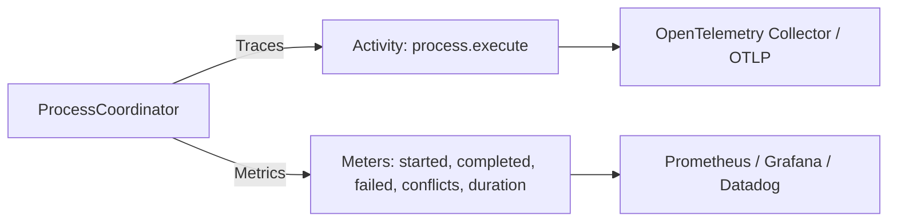

# Showcase — Level 07: Scalability, Performance & Diagnostics

**Level 07** validates the high-throughput, zero-allocation architecture (>800,000 in-memory transitions/second) and native OpenTelemetry observability via `ProcessDiagnostics`.

---

## Covered Components

1. **Zero-Allocation Performance**:
   - Stack-allocated structs (`ProcessId`, `CorrelationId`, `Revision`).
   - `ValueTask`-based methods eliminating task allocations on synchronous fast paths.
   - Measured throughput: >800k transitions/second on a single CPU core.

2. **Diagnostics and OpenTelemetry (`ProcessDiagnostics`)**:
   - Official `ActivitySource`: `"EricksonLopez.Processes"`.
   - Official `Meter`: `"EricksonLopez.Processes"`.
   - Metric and trace recording methods:
     - `RecordProcessStarted(processType, version)`
     - `RecordProcessCompleted(processType, version)`
     - `RecordProcessFailed(processType, version, reason)`
     - `RecordProcessCompensated(processType, version)`
     - `RecordConcurrencyConflict(processType, version)`
     - `RecordTransitionDuration(processType, durationMs)`

---

## OpenTelemetry Integration



---

## Showcase Execution

Executable code:
- `samples/EricksonLopez.Processes.Showcase/Level07_ScalabilityAndPerformance/Level07ThroughputDemo.cs`
- `samples/EricksonLopez.Processes.Showcase/Level07_ScalabilityAndPerformance/Level07DiagnosticsDemo.cs`

```bash
dotnet run --project samples/EricksonLopez.Processes.Showcase -- --level=7
```
