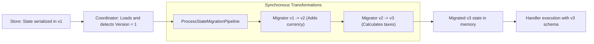

# Showcase — Level 10: Enterprise Architecture (Schema Migration & Native AOT)

**Level 10** addresses two foundational pillars for enterprise-scale deployments: zero-downtime state schema evolution via `ProcessStateMigrationPipeline` and zero-reflection ahead-of-time compilation (**Native AOT**) using Roslyn Source Generators.

---

## Covered Components

1. **State Migration Pipeline (`ProcessStateMigrationPipeline`)**:
   - `IProcessStateMigrator<TFrom, TTo>`: Synchronous state transformation contract.
   - `ProcessStateMigrationPipeline.Create<TInitial>(initialVersion)`: Fluent builder factory.
   - Step chaining (`AddStep`) for continuous multi-version migrations (e.g. v1 -> v2 -> v3).
   - Automated detection in `ProcessCoordinator`: when the stored version is lower than current version, the pipeline is applied prior to invoking handlers.

2. **Native AOT & Roslyn Source Generators**:
   - Compile-time process discovery using `[ProcessDefinition]` and `[SagaDefinition]`.
   - Compile-time generated registration: `services.AddGeneratedProcesses()`.
   - Zero usage of `System.Reflection` or `MakeGenericMethod`.
   - Trimming-safe, AOT serialization with `JsonSerializerContext`.

---

## Zero-Downtime Hot Schema Migration Flow



---

## Showcase Execution

Executable code:
- `samples/EricksonLopez.Processes.Showcase/Level10_EnterpriseArchitecture/Level10SchemaMigrationDemo.cs`
- `samples/EricksonLopez.Processes.Showcase/Level10_EnterpriseArchitecture/Level10NativeAotDemo.cs`

```bash
dotnet run --project samples/EricksonLopez.Processes.Showcase -- --level=10
```
